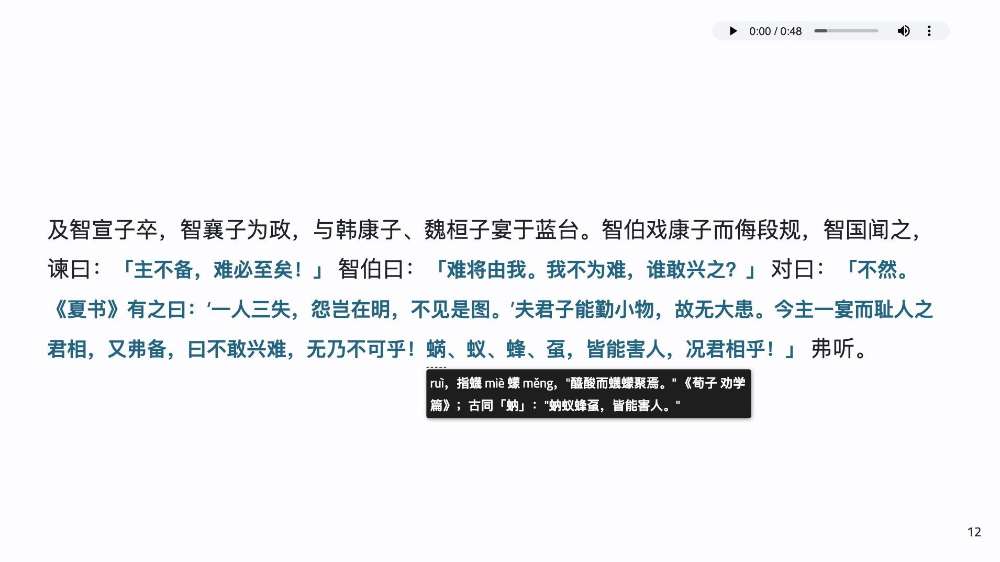
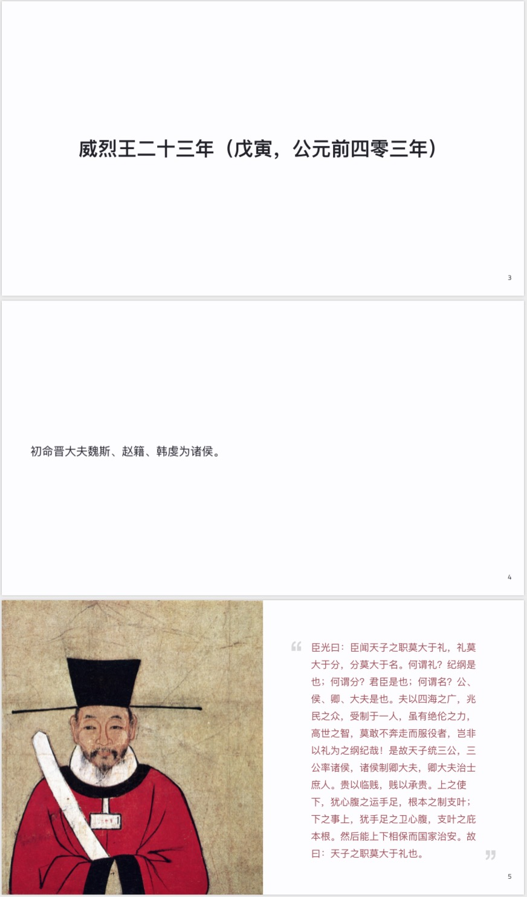

# 《资治通鉴》胶片版

作为一个喜欢且经常读史读古文的程序员，《资治通鉴》这样的大部头我读起来还是觉得非常费力。首先是时间上的开销很大 —— 一页纸往往要读上半小时到一小时，其中免不了查阅词典，了解生僻字词的读音和释义；其次是难以深度阅读 —— 大量的地名人名和时间的关系，无法很快厘清，因而对错综复杂的历史事件读之依旧是懵懵懂懂；再次，无论是实体书的阅读，还是电子书的阅读，笔记都很难处理，比如人物的图像，事件（主要是战争）的地图，无法和原文很好地一一对照。最后，三百万字，二百九十四卷的内容，往往令读者还未开始阅读便自我放弃了。

于是我便萌生了制作《资治通鉴》胶片版的念头。我可阅读的时间往往比较碎片化，所以希望闲暇时可以读上一小段，这样不必抱着大部头望而兴叹；我希望文档本身是活的，帮助理解内容的佐料（注释，图片，地图等）可以不断以一种简单轻量的方式被添加进来；此外，文档本身应该是精美的，看着舒服。这便是这个胶片版的最初的目标。

这个目标进一步细化，便成了这个样子：

- [x] 选取质量上乘的《资治通鉴》 txt 版本
- [x] 将文档切分成 294 卷，每卷一个胶片
- [x] 自动生成符合 [marp](https://marpit.marp.app/) 格式的胶片，做一些格式上的处理
  - [x] 为引文生成不同的格式
  - [x] 每页胶片都自动放置一个 audio tag，可以播放本页的语音素材，比如：[臣光曰](slides/assets/audios/001/4.mp3)
- [ ] ~~找相熟的小伙伴们创作每一张胶片的语音素材~~ 为每一张胶片自动生成语音素材
- [ ] 通读之，添加注释，相关图片和地图

制作出来的 slides 截图如下：







## 运行

本地需要有 nodejs 运行时，然后安装依赖：

```bash
make init
make dep
```

之后可以 `make run` 运行 http 服务器。服务器运行完毕后，可以在浏览器中打开 `http://localhost:8080/` 查阅。

如果要批量生成 html / pdf 版本，可以 `make build` 或者 `make build-pdf`。

## 语音素材的生成

《资治通鉴》胶片版内的所有语音素材均使用 __科大讯飞开放平台__ 的在线语音合成技术提供。目前使用的发音人为 __讯飞楠楠__。感谢科大讯飞的开放平台，我得以自动化生成所有语音素材。由于目前我使用的免费版有日 API 访问上限，所以所有内容生成语音素材尚需时日。

如果你想生成自己的语音素材，可以在科大讯飞开放平台创建账户，生成你的 appid / app_key，并将其配置到环境变量 `XF_TTS_ID` 和 `XF_TTS_KEY` 中。之后你可以使用 `make gen-audios CHAPTER=xxx` 来生成对应卷的语音素材。

如果你对生成语音素材感兴趣，可以看这几个工具：

- tools/cli/normalizer.js: 把原始的文本素材转化为 JSON。
- tools/cli/generator.js: 将 JSON 转化为 marp slides。
- tools/cli/tts.js: 读取 `resources/_meta` 中的文件，按章节生成语音素材。

## 如何编辑及添加素材

所有的素材都放在 `slides/assets` 下，按卷命名。

### 添加图片或者地图

以这张 slide 为例：


可以把对应的图片拷贝至 `assets/images/001/jinyang.jpg`，然后在对应的 slide 页中使用 marp 的 [图片语法](https://marpit.marp.app/image-syntax)，如下：

```markdown
---


赵襄子使张孟谈潜出见二子，曰：__「臣闻唇亡则齿寒。今智伯帅韩、魏而攻赵，赵亡则韩、魏为之次矣。」__ 二子曰：__「我心知其然也，恐事末遂而谋泄，则祸立至矣」__ 。张孟谈曰：__「谋出二主之口，入臣之耳，何伤也？」__ 二子乃阴与张孟谈约，为之期日而遣之。襄子夜使人杀守堤之吏，而决水灌智伯军。智伯军救水而乱，韩、魏翼而击之，襄子将卒犯其前，大败智伯之众。遂杀智伯，尽灭智氏之族。唯辅果在。

---
```

### 添加注释

注释使用 `abbr` 完成。以这张 slide 为例：


要注释的内容用 `*[]:` 括起来，注释放在 `:` 后即可。注意如果注释的内容前后没有标点或者空格，需要再原文中手工插入空格。

```markdown
---


及智宣子卒，智襄子为政，与韩康子、魏桓子宴于蓝台。智伯戏康子而侮段规，智国闻之，谏曰：__「主不备，难必至矣！」__ 智伯曰：__「难将由我。我不为难，谁敢兴之？」__ 对曰：__「不然。《夏书》有之曰：‘一人三失，怨岂在明，不见是图。’夫君子能勤小物，故无大患。今主一宴而耻人之君相，又弗备，曰不敢兴难，无乃不可乎！蜹、蚁、蜂、虿，皆能害人，况君相乎！」__ 弗听。

*[蜹]: ruì，指蠛 miè 蠓 měng，"醯酸而蠛蠓聚焉。" 《荀子 劝学篇》；古同「蚋」："蚋蚁蜂虿，皆能害人。"

---
```

### 添加脚注

脚注比较特殊，正常的 markdown 脚注会放在整个文档最后，并不方便阅读，这里生成了 `<div class="note">` 完成。以这张 slide 为例：


其语法是在要注释的地方使用上标语法 `^xx^`，然后用 `::: note` 和 `:::` 标注脚注的开始和结束。

```markdown
---


秦侵晋^1^。


::: note
在《吴子 励士 第六》中有这样两段文字：“行之三年，秦人兴师，临于西河，魏士闻之，不待吏令，介胄而奋击之者，以万数。”，“于是武侯从之。兼车五百乘，骑三千匹，而破秦五十万众。”区区52个字，记录了阴晋之战的经过。
:::

---
```

## 贡献

目前的版本是自动生成的，还很粗糙，我自己也在边读边整理。如果你遇到任何问题，欢迎提 issue，当然跟欢迎发 pull request。


## 鸣谢


### 河洛·基督大伯爵

原始 txt 素材来自 [河洛中文社区](http://www.horou.com)，由【河洛·基督大伯爵 】整理校对。

┏━━━━━━━━━━━━━━━━━━━━━━━━━━━━━━━━━━━━━━━━━━━━━━━┓
　精校小说尽在河洛中文社区：http://www.horou.com/
　本电子书由【河洛·基督大伯爵 】整理校对，请勿转载。
　版权归原作者所有，文本仅供试读，请勿用于一切商业用途！
┗━━━━━━━━━━━━━━━━━━━━━━━━━━━━━━━━━━━━━━━━━━━━━━━┛

### 科大讯飞开放平台

tts 的质量相当上乘，在此感谢！
