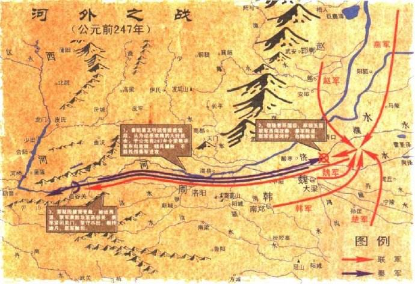
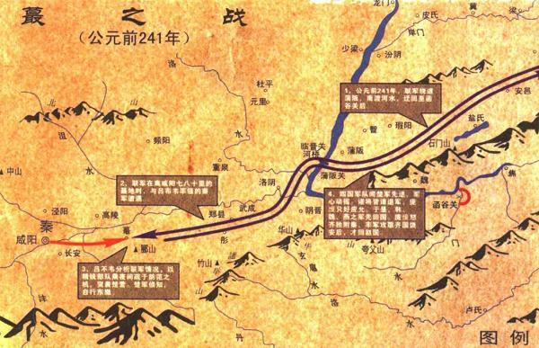
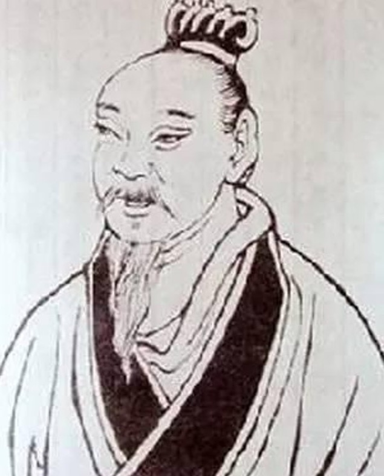

# 秦纪 第一章 秦纪一

---

起柔兆敦牂，尽昭阳作噩，凡二十八年。

---

# 秦昭襄王

---

## 五十二年（丙午，公元前二五五年）

---

河东守王稽坐与诸侯通，弃市。应侯日以不怿。王临朝而叹，应侯请其故。王曰：__「今武安君死，而郑安平、王稽等皆畔，内无良将而外多敌国，吾是以忧。」__ 应侯惧，不知所出。燕客蔡泽闻之，西入秦，先使人宣言于应侯曰：__「蔡泽，天下雄辩之士。彼见王，必困君而夺君之位。」__ 应侯怒，使人召之。蔡泽见应侯，礼又倨。应侯不快，因让之曰：__「子宣言欲代我相，请闻其说。」__ 蔡泽曰：__「吁，君何见之晚也！夫四时之序，成功者去。君独不见夫秦之商君、楚之吴起、越之大夫种，何足愿与？」__ 应侯谬曰：__「何为不可？！此三子者，义之至也，忠之尽也。君子有杀身以成名，死无所恨！」__ 蔡泽曰：__「夫人立功岂不期于成全邪？身名俱全者，上也；名可法而身死者，次也；名戮辱而身全者，下也。夫商君、吴起、大夫种，其为人臣尽忠致功，则可愿矣。闳夭、周公，岂不亦忠且圣乎？！三子之可愿，孰与闳夭、周公哉？」__ 应侯曰：__「善。」__ 蔡泽曰：__「然则君之主惇厚旧故，不倍功臣，孰与孝公、楚王、越王？」__ 曰：__「未知何如。」__ 蔡泽曰：__「君之功能孰与三子？」__ 曰：__「不若。」__ 蔡泽曰：__「然则君身不退，患恐甚于三子矣。语曰：‘日中则移，月满则亏。’进退嬴缩，与时变化，圣人之道也。今君之怨已雠而德已报，意欲至矣而无变计，窃为君危之。」__ 应侯遂延以为上客，因荐于王。王召与语，大悦，拜为客卿。应侯因谢病免。王新悦蔡泽计画，遂以为相国，泽为相数月，免。

---

楚春申君以荀卿为兰陵令。荀卿者，赵人，名况，尝与临武君论兵于赵孝成王之前。王曰：__「请问兵要。」__ 临武君对曰：__「上得天时，下得地利，观敌之变动，后之发，先之至，此用兵之要术也。」__ 荀卿曰：__「不然。臣所闻古之道，_凡用兵攻战之本，在乎一民_。弓矢不调，则羿不能以中；六马不和，则造父不能以致远；士民不亲附，则汤、武不能以必胜也。故善附民者，是乃善用兵者也。故兵要在乎附民而已。」__ 临武君曰：__「不然。兵之所贵者势利也，所行者变诈也。善用兵者感忽悠闇，莫知所从出。孙吴用之，无敌于天下，岂必待附民哉！」__ 荀卿曰：__「不然。臣之所道，仁人之兵，王者之志也。君之所贵，权谋势利也。仁人之兵，不可诈也。彼可诈者，怠慢者也，露袒者也，君臣上下之间滑然有离德者也。故以桀诈桀，犹巧拙有幸焉。_以桀诈尧，譬之以卵投石，以指桡沸，若赴水火，入焉焦没耳_。故仁人之兵，上下一心，三军同力。臣之于君也，下之于上也，若子之事父，弟之事兄，若手臂之扞头目而覆胸腹也。诈而袭之，与先惊而后击之，一也。且仁人用十里之国则将有百里之听，用百里之国则将有千里之听，用千里之国则将有四海之听，必将聪明警戒，和傅而一。故仁人之兵，聚则成卒，散则成列，延则若莫耶之长刃，婴之者断；兑则若莫耶之利锋，当之者溃。圜居而方止，则若盘石然，触之者角摧而退耳。且夫暴国之君，将谁与至哉？彼其所与至者，必其民也。其民之亲我欢若父母，其好我芬若椒兰；彼反顾其上则若灼黥，若仇雠；人之情，虽桀、跖，岂有肯为其所恶，贼其所好者哉！是犹使人之子孙自贼其父母也。彼必将来告之，夫又何可诈也！故仁人用国日明，诸侯先顺者安，后顺者危，敌之者削，反之者亡。《诗》曰：‘武王载发，有虔秉钺，如火烈烈，则莫我敢遏，’此之谓也。」__

---

孝成王、临武君曰：__「善。请问王者之兵，设何道，何行而可？」__ 荀卿曰：__「凡君贤者其国治，君不能者其国乱；隆礼贵义者其国治，简礼贱义者其国乱。治者强，乱者弱，是强弱之本也。上足卬则下可用也，上不足卬则下不可用也。下可用则强，下不可用则弱，是强弱之常也。_好士者强，不好士者弱；爱民者强，不爱民者弱；政令信者强，政令不信者弱；重用兵者强，轻用兵者弱；权出一者强，权出二者弱；是强弱之常也_。齐人隆技击，其技也，得一首者则赐赎锱金，无本赏矣。是事小敌毳，则偷可用也；事大敌坚，则涣焉离耳。若飞鸟然，倾侧反覆无日，是亡国之兵也，兵莫弱是矣，是其去赁市佣而战之几矣。魏氏之武卒，以度取之；衣三属之甲，操十二石之弩，负矢五十个，置戈其上，冠胄带剑，赢二日之粮，日中而趋百里；中试则复其户，利其田宅。是其气力数年而衰，而复利未可夺也，改造则不易周也，是故地虽大，其税必寡，是危国之兵也。秦人，其生民也狭隘，其使民也酷烈，_劫之以势，隐之以厄，忸之以庆赏，鳅之以刑罚_，使民所以要利于上者，非斗无由也。使以功赏相长，五甲首而隶五家，是最为众强长久之道。故四世有胜，非幸也，数也。_故齐之技击不可以遇魏之武卒，魏之武卒不可以遇秦之锐士，秦之锐士不可以当桓、文之节制，桓、文之节制不可以当汤、武之仁义，有遇之者，若以焦熬投石焉_。兼是数国者，皆干赏蹈利之兵也，佣徒鬻卖之道也，未有贵上安制綦节之理也。诸侯有能微妙之以节，则作而兼殆之耳。故招延募选，隆势诈，尚功利，是渐之也。礼义教化，是齐之也。故以诈遇诈，犹有巧拙焉；以诈遇齐，譬之犹以锥刀堕太山也。故汤、武之诛桀、纣也，拱挹指麾，而强暴之国莫不趋使，诛桀、纣若诛独夫。故《泰誓》曰：‘独夫纣’ 此之谓也。故兵大齐则制天下，小齐则治邻敌。若夫招延募选，隆势诈，尚功利之兵，则胜不胜无常，代翕代张，代存代亡，相为雌雄耳。夫是之谓盗兵，君子不由也。」__

---

孝成王、临武君曰：__「善。请问为将。」__ 荀卿曰：__「_知莫大乎弃疑，行莫大乎无过，事莫大乎无悔_。事至无悔而止矣，不可必也。_故制号政令，欲严以威；庆赏刑罚，欲必以信；处舍收藏，欲周以固；徙举进退，欲安以重，欲疾以速；窥敌观变，欲潜以深，欲伍以参；遇敌决战，必行吾所明，无行吾所疑；夫是之谓六术_。_无欲将而恶废，无怠胜而忘败，无威内而轻外，无见其利而不顾其害，凡虑事欲熟而用财欲泰，夫是之谓五权_。将所以不受命于主有三，_可杀而不可使处不完，可杀而不可使击不胜，可杀而不可使欺百姓，夫是之谓三至_。凡受命于主而行三军，三军既定，百官得序，群物皆正，则主不能喜，敌不能怒，夫是之谓至臣。虑必先事而申之以敬，慎终如始，始终如一，夫是之谓大吉。_凡百事之成也必在敬之，其败也必在慢之_。故敬胜怠则吉，怠胜敬则灭；计胜欲则从，欲胜计则凶。战如守，行如战，有功如幸。_敬谋无旷，敬事无旷，敬吏无旷，敬众无旷，敬敌无旷，夫是之谓五无旷_。慎行此 _六术_、_五权_、_三至_，而处之以恭敬、无旷，夫是之谓天下之将，则通于神明矣。」__

---

临武君曰：__「善。请问王者之军制。」__ 荀卿曰：__「将死鼓，御死辔，百吏死职，士大夫死行列。闻鼓声而进，闻金声而退。顺命为上，有功次之。令不进而进，犹令不退而退也，其罪惟均。不杀老弱，不猎禾稼，服者不禽，格者不赦，奔命者不获。凡诛，非诛其百姓也，诛其乱百姓者也。百姓有扞其贼，则是亦贼也。以故顺刃者生，傃刃者死，奔命者贡。微子开封于宋，曹触龙断于军，商之服民，所以养生之者无异周人，故近者歌讴而乐之，远者竭蹶而趋之，无幽闲辟陋之国，莫不趋使而安乐之，四海之内若一家，通达之属莫不从服，夫是之谓人师。《诗》曰：‘自西自东，自南自北，无思不服。’此之谓也。王者有诛而无战，城守不攻，兵格不击，敌上下相喜则庆之，不屠城，不潜军，不留众，师不越时，故乱者乐其政，不安其上，欲其至也。」__ 临武君曰：__「善。」__

---

陈嚣问荀卿曰：__「先生议兵，常以仁义为本。仁者爱人，义者循理，然则又何以兵为？凡所为有兵者，为争夺也。」__ 荀卿曰：__「非汝所知也。彼仁者爱人，爱人，故恶人之害之也；义者循理，循理，故恶人之乱之也。彼兵者，所以禁暴除害也，非争夺也。」__

---

燕孝王薨，子喜立。

---

周民东亡。秦人取其宝器，迁西周公于惮狐之聚。

---

楚人迁鲁于莒而取其地。

---

## 五十三年（丁未，公元前二五四年）

---

摎伐魏，取吴城。韩王入朝。魏举国听令。

---

## 五十四年（戊申，公元前二五三年）

---

王郊见上帝于雍。

---

楚迁于巨阳。

---

## 五十五年（己酉，公元前二五二年）

---

卫怀君朝于魏，魏人执而杀之；更立其弟，是为元君。元君，魏婿也。

---

## 五十六年（庚戌，公元前二五一年）

---

秋，王薨，孝文王立。尊唐八子为唐太后，以子楚为太子。赵人奉子楚妻子归之。韩王衰绖入吊祠。

---

燕王喜使栗腹约欢于赵，以五百金为赵王酒。反而言于燕王曰：__「赵壮者皆死长平，其孤未壮，可伐也。」__ 王召昌国君乐闲问之，对曰：__「赵四战之国，其民习兵，不可。」__ 王曰：__「吾以五而伐一。」__ 对曰：__「不可。」__ 王怒。群臣皆以为可，乃发二千乘，栗腹将而攻鄗，卿秦攻代。将渠曰：__「与人通关约交，以五百金饮人之王，使者报而攻之，不祥，师必无功。」__ 王不听，自将偏军随之。将渠引王之绶，王以足蹙之。将渠泣曰：__「臣非自为，为王也！」__ 燕师至宋子，赵廉颇为将，逆击之，败栗腹于鄗，败卿秦、乐乘于代，追北五百余里，遂围燕。燕人请和，赵人曰：__「必令将渠处和。」__ 燕王以将渠为相而处和，赵师乃解去。

---

赵平原君卒。

---

# 秦孝文王

---

## 元年（辛亥，公元前二五零年）

---

冬，十月，已亥，王即位；三日薨。子楚立，是为庄襄王。尊华阳夫人为华阳太后，夏姬为夏太后。

---

燕将攻齐聊城，拔之。或谮之燕王，燕将保聊城，不敢归。齐田单攻之，岁余不下，鲁仲连乃为书，约之矢以射城中，遗燕将，为陈利害曰：__「为公计者，不归燕则归齐。今独守孤城，齐兵日益而燕救不至，将何为乎？」__ 燕将见书，泣三日，犹豫不能自决，欲归燕，已有隙；欲降齐，所杀虏于齐甚众，恐已降而后见辱。喟然叹曰：__「与人刃我，宁我自刃！」__ 遂自杀。聊城乱，田单克聊城。归，言鲁仲连于齐王，欲爵之。仲连逃之海上，曰：__「吾富贵而诎于人，宁贫贱而轻世肆志焉！」__

---

魏安厘王问天下之高士于子顺，子顺曰：__「世无其人也；抑可以为次，其鲁仲连乎！」__ 王曰：__「鲁仲连强作之者，非体自然也。」__ 子顺曰：__「人皆作之。作之不止，乃成君子；作之不变，习与体成；习与体成，则自然也。」__

---

# 秦庄襄王

---

## 元年（壬子，公元前二四九年）

---

吕不韦为相国。

---

东周君为诸侯谋伐秦，王使相国帅师讨灭之，迁东周君于阳人聚。周既不祀。周比亡，凡有七邑：河南、洛阳、谷城、平阴、偃师、巩、缑氏。

---

以河南、洛阳十万户封相国不韦为文信侯。

---

蒙骜伐韩，取成皋、荥阳，初置三川郡。

---

楚灭鲁，迁鲁顷公于卞，为家人。

---

## 二年（癸丑，公元前二四八年）

---

日有食之。

---

蒙骜伐赵，定太原，取榆次、狼孟等三十七城。

---

楚春申君言于楚王曰：__「淮北地边于齐，其事急，请以为郡而封于江东。」__ 楚王许之。春申君因城吴故墟以为都邑，宫室极盛。

---

## 三年（甲寅，公元前二四七年）

---

王龁攻上党诸城，悉拔之，初置太原郡。

---

蒙骜帅师伐魏，取高都、汲。魏师数败，魏王患之，乃使人请信陵君于赵。信陵君畏得罪，不肯还，诫门下曰：__「有敢为魏使通者死！」__ 宾客莫敢谏。毛公、薛公见信陵君曰：__「公子所以重于诸侯者，徒以有魏也。今魏急而公子不恤，一旦秦人克大梁，夷先王之宗庙，公子当何面目立天下乎！」__ 语未卒，信陵君色变，趣驾还魏。魏王持信陵君而泣，以为上将军。信陵君使人求援于诸侯。诸侯闻信陵君复为魏将，皆遣兵救魏。信陵君率五国之师败蒙骜于河外，蒙骜遁走。信陵君追至函谷关，抑之而还。安陵人缩高之子仕于秦，秦使之守管。信陵君攻之不下，使人谓安陵君曰：__「君其遣缩高，吾将仕之以五大夫，使为执节尉。」__ 安陵君曰：__「安陵，小国也，不能必使其民。使者自往请之。」__ 使吏导使者至缩高之所。

---

使者致信陵君之命，缩高曰：__「君之幸高也，将使高攻管也。夫父攻子守，人之笑也；见臣而下，是倍主也。父教子倍，亦非君之所喜。敢再拜辞！」__ 使者以报信陵君。信陵君大怒，遣使之安陵君所曰：__「安陵之地，亦犹魏也。今吾攻管而不下，则秦兵及我，社稷必危矣。愿君生束缩高而致之！若君弗致，无忌将发十万之师以造安陵之城下！」__ 安陵君曰：__「吾先君成侯受诏襄王以守此城也，手授太府之宪，宪之上篇曰：‘子弑父，臣弑君，有常不赦。国虽大赦，降城亡子不得与焉。’今缩高辞大位以全父子之义，而君曰‘必生致之’，是使我负襄王之诏而废太府之宪也，虽死，终不敢行！」__ 缩高闻之曰：__「信陵君为人，悍猛而自用，此辞反必为国祸。吾已全己，无违人臣之义矣，岂可使吾君有魏患乎！」__ 乃之使者之舍，刎颈而死。

---

信陵君闻之，缟素辟舍，使使者谢安陵君曰：__「无忌，小人也，困于思虑，失信于君，请再拜辞罪！」__

---

王使人行万金于魏以间信陵君，求得晋鄙客，令说魏王曰：__「公子亡在外十年矣，今复为将，诸侯皆属，天下徒闻信陵君而不闻魏王矣。」__ 王又数使人贺信陵君：__「得为魏王未也？」__ 魏王日闻其毁，不能不信，乃使人代信陵君将兵。信陵君自知再以毁废，乃谢病不朝，日夜以酒色自娱，凡四岁而卒。韩王往吊，其子荣之，以告子顺。子顺曰：__「必辞之以礼。‘邻国君吊，君为之主。’今君不命子，则子无所受韩君也。」__ 其子辞之。

---

五月，丙午，王薨。太子政立，生十三年矣，国事皆委于文信侯，号称仲父。

---

晋阳反。

---

# 秦始皇帝上

---

## 元年（乙卯，公元前二四六年）

---

蒙骜击定之。

---

韩欲疲秦人，使无东伐，乃使水工郑国为间于秦，凿泾水自仲山为渠，并北山，东注洛。中作而觉，秦人欲杀之。郑国曰：__「臣为韩延数年之命，然渠成，亦秦万世之利也。」__ 乃使卒为之。注填阏之水溉舄卤之地四万余顷，收皆亩一钟，关中由是益富饶。

---

## 二年（丙辰，公元前二四五年）

---

麃公将卒攻卷，斩首三万。

---

赵以廉颇为假相国，伐魏，取繁阳。赵孝成王薨，子悼襄王立，使武襄君乐乘代廉颇。廉颇怒，攻武襄君，武襄君走，廉颇出奔魏。久之，魏不能信用。赵师数困于秦，赵王思复得廉颇，廉颇亦思复用于赵。赵王使使者视廉颇尚可用否。廉颇之仇郭开多与使者金，令毁之。廉颇见使者，一饭斗米，肉十斤，被甲上马，以示可用。使者还报曰：__「廉将军虽老，尚善饭；然与臣坐，顷之三遗矢矣。」__ 赵王以为老，遂不召。楚人阴使迎之。廉颇一为楚将，无功，曰：__「我思用赵人。」__ 卒死于寿春。

---

## 三年（丁巳，公元前二四四年）

---

大饥。

---

蒙骜伐韩，取十二城。

---

赵王以李牧为将，伐燕，取武遂、方城。李牧者，赵之北边良将也，尝居代、雁门备匈奴，以便宜置吏，市租皆输入莫府，为士卒费，日击数牛飨士；习骑射，谨烽火，多间谍，为约曰：__「匈奴即入盗，急入收保。有敢捕虏者斩！」__ 匈奴每入，烽火谨，辄入收保不战。如是数岁，亦不亡失。匈奴皆以为怯，虽赵边兵亦以为吾将怯。赵王让之，李牧如故。王怒，使他人代之。岁余，屡出战，不利，多失亡，边不得田畜。王复请李牧，李牧杜门称病不出。王强起之，李牧曰：__「必用臣，臣如前，乃敢奉令。」__ 王许之。

---

李牧至边，如约。匈奴数岁无所得，终以为怯。边士日得赏赐而不用，皆愿一战。于是乃具选车得千三百乘，选骑得万三千匹，百金之士五万人，彀者十万人，悉勒习战；大纵畜牧、人民满野。匈奴小入，佯北不胜，以数十人委之。单于闻之，大率众来入。李牧多为奇陈，张左、右翼击之，大破之，杀匈奴十余万骑，灭衤詹褴，破东胡，降林胡。单于奔走，十余岁不敢近赵边。

---

先是时，天下冠带之国七，而三国边于戎狄：秦自陇以西有绵诸、绲戎、翟、之戎，岐、梁、泾、漆之北有义渠、大荔、乌氏、朐衍之戎；而赵北有林胡、楼烦之戎；燕北有东胡、山戎；各分散居溪谷，自有君长，往往而聚者百有余戎，然莫能相一。其后义渠筑城郭以自守，而秦稍蚕食之，至惠王遂拔义渠二十五城。昭王之时，宣太后诱义渠王，杀诸甘泉，遂发兵伐义渠，灭之；始于陇西、北地、上郡筑长城以拒胡。赵武灵王北破林胡、楼烦，筑长城，自代并阴山下，至高阙为塞，而置云中、雁门、代郡。其后燕将秦开为质于胡，胡甚信之；归而袭破东胡，东胡却千余里；燕亦筑长城，自造阳至襄平，置上谷、渔阳、右北平、辽东郡以距胡。及战国之末而匈奴始大。

---

## 四年（戊午，公元前二四三年）

---

春，蒙骜伐魏，取旸、有诡。三月，军罢。

---

秦质子归自赵；赵太子出归国。

---

七月，蝗，疫。令百姓纳粟千石，拜爵一级。

---

魏安厘王薨，子景湣王立。

---

## 五年（己未，公元前二四二年）

---

蒙骜伐魏，取酸枣、燕、虚、长平、雍丘、山阳等二十城；初置东郡。

---

初，剧辛在赵与庞 爰善，已而仕燕。燕王见赵数困于秦，廉颇去而庞 爰为将，欲因其敝而攻之，问于剧辛，对曰：__「庞 爰易与耳。」__ 燕王使剧辛将而伐赵。赵庞 爰御之，杀剧辛，取燕师二万。

---

诸侯患秦攻伐无已时。

---

## 六年（庚申，公元前二四一年）

---

楚、赵、魏、韩、卫合从以伐秦，楚王为从长，春申君用事，取寿陵。至函谷，秦师出，五国之师皆败走。楚王以咎春申君，春申君以此益疏。观津人朱英谓春申君曰：__「人皆以楚为强，君用之而弱。其于英不然。先君时，秦善楚，二十年而不攻楚，何也？秦逾黾 厄之塞而攻楚，不便；假道于两周，背韩、魏而攻楚，不可。今则不然。魏旦暮亡，不能爱许、鄢陵，魏割以与秦，秦兵去陈百六十里。臣之所观者，见秦、楚之日斗也。」__ 楚于是去陈，徙寿春，命曰郢。春申君就封于吴，行相事。

---

秦拔魏朝歌，及卫濮阳。卫元君率其支属徙居野王，阻其山以保魏之河内。

---

## 七年（辛酉，公元前二四零年）

---

伐魏，取汲。

---

夏太后薨。

---

蒙骜卒。

---

## 八年（壬戌，公元前二三九年）

---

魏与赵邺。

---

韩桓惠王薨，子安立。

---

## 九年（癸亥，公元前二三八年）

---

伐魏，取垣、浦。

---

夏，四月，寒，民有冻死者。

---

# 王宿雍。

---

己酉，王冠，带剑。

---

杨端和伐魏，取衍氏。

---

初，王即位，年少，太后时时与文信侯私通。王益壮，文信侯恐事觉，祸及己，乃诈以舍人嫪毐为宦者，进于太后。太后幸之，生二子，封毐为长信侯，以太原为毐国，政事皆决于毐；客求为毐舍人者甚众。王左右有与毐争言者，告毐实非宦者，王下吏治毐。毐惧，矫王御玺发兵，欲攻蕲年宫为乱。王使相国昌平君、昌文君发卒攻毐，战咸阳，斩首数百；毐败走，获之。秋，九月，夷毐三族；党与皆车裂灭宗；舍人罪轻者徙蜀，凡四千余家。迁太后于雍萯阳宫，杀其二子。下令曰：__「敢以太后事谏者，戮而杀之，断其四支，积之阙下！」__ 死者二十七人。齐客茅焦上谒请谏。王使谓之曰：__「若不见夫积阙下者邪？」__ 对曰：__「臣闻天有二十八宿，今死者二十七人，臣之来固欲满其数耳。臣非畏死者也！」__ 使者走入白之。

---

茅焦邑子同食者，尽负其衣物而逃王。王大怒曰：__「是人也，故来犯吾，趣召镬烹之，是安得积阙下哉！」__ 王按剑怒而坐，口正沫出。使者召之入，茅焦徐行至前，再拜谒起，称曰：__「臣闻有生者不讳死，有国者不讳亡。讳死者不可以得生，讳亡者不可以得存。死生存亡，圣主所欲急闻也，陛下欲闻之乎？」__ 王曰：__「何谓也？」__ 茅焦曰：__「陛下有狂悖之行，不自知邪？车裂假父，囊扑二弟，迁母于雍，残戮谏士，桀、纣之行不至于是矣。令天下闻之，尽瓦解，无向秦者，臣窃为陛下危之！臣言已矣！」__ 乃解衣伏质。王下殿，手自接之曰：__「先生起就衣，今愿受事！」__ 乃爵之上卿。王自驾，虚左方，往迎太后，归于咸阳，复为母子如初。

---

楚考烈王无子，春申君患之，求妇人宜子者甚众，进之，卒无子。赵人李园持其妹欲进诸楚王，闻其不宜子，恐久无宠，乃求为春申君舍人。已而谒归，故失期而还。春申君问之，李园曰：__「齐王使人求臣之妹，与其使者饮，故失期。」__ 春申君曰：__「聘入乎？」__ 曰：__「未也。」__ 春申君遂纳之。既而有娠，李园使其妹说春申君曰：__「楚王贵幸君，虽兄弟不如也。今君相楚二十余年而王无子，即百岁后将更立兄弟，彼亦各贵其故所亲，君又安得常保此宠乎！非徒然也，君贵，用事久，多失礼于王之兄弟，兄弟立，祸且及身矣。今妾有娠而人莫知，妾幸君未久，诚以君之重，进妾于王，王必幸之。妾赖天而有男，则是君之子为王也。楚国尽可得，孰与身临不测之祸哉！」__ 春申君大然之。乃出李园妹，谨舍而言诸楚王。王召入，幸之，遂生男，立为太子。

---

李园妹为王后，李园亦贵用事，而恐春申君泄其语，阴养死士，欲杀春申君以灭口；国人颇有知之者。楚王病，朱英谓春申君曰：__「世有无望之福，亦有无望之祸。今君处无望之世，事无望之主，安可以无无望之人乎！」__ 春申君曰：__「何谓无望之福？」__ 曰：__「君相楚二十余年矣，虽名相国，其实王也。王今病，旦暮薨，薨而君相幼主，因而当国，王长而反政，不即遂南面称孤，此所谓无望之福也。」__ __「何谓无望之祸？」__ 曰：__「李园不治国而君之仇也，不为兵而养死士之日久矣。王薨，李园必先入，据权而杀君以灭口，此所谓无望之祸也。」__ __「何谓无望之人？」__ 曰：__「君置臣郎中，王薨，李园先入，臣为君杀之，此所谓无望之人也。」__ 春申君曰：__「足下置之。李园，弱人也，仆又善之。且何至此！」__ 朱英知言不用，惧而亡去。

---

后十七日，楚王薨，李园果先入，伏死士于棘门之内。春申君入，死士侠刺之，投其首于棘门之外；于是使吏尽捕诛春申君之家。太子立，是为幽王。

---

扬子《法言》曰：或问：__「信陵、平原、孟尝、春申益乎？」__ 曰：__「上失其政，奸臣窃国命，何其益乎！」__

---

王以文信侯奉先王功大，不忍诛。

---

## 十年（甲子，公元前二三七年）

---

冬，十月，文信侯免相，出就国。

---

宗室大臣议曰：__「诸侯人来仕者，皆为其主游间耳，请一切逐之。」__ 于是大索，逐客。客卿楚人李斯亦在逐中，行，且上书曰：__「昔穆公求士，西取由余于戎，东得百里奚于宛，迎蹇叔于宋，求丕豹、公孙支于晋，并国二十，遂霸西戎。孝公用商鞅之法，诸侯亲服，至今治强。惠王用张仪之计，散六国之从，使之事秦。昭王得范雎，强公室，杜私门。此四君者，皆以客之功。由此观之，客何负于秦哉！夫色、乐、珠、玉不产于秦而王服御者众，取人则不然，不问可否，不论曲直，非秦者去，为客者逐。是所重者在乎色、乐、珠、玉，而所轻者在乎人民也。臣闻 _太山不让土壤，故能成其大；河海不择细流，故能就其深；王者不却众庶，故能明其德_。此五帝、三王之所以无敌也。今乃弃黔首以资敌国，却宾客以业诸侯，所谓藉寇兵而赍盗粮者也。」__

---

王乃召李斯，复其官，除逐客之令。李斯至骊邑而还。王卒用李斯之谋，阴遣辩士赍金玉游说诸侯，诸侯名士可下以财者厚遗结之，不肯者利剑刺之，离其君臣之计，然后使良将随其后，数年之中，卒兼天下。

---

## 十一年（乙丑，公元前二三六年）

---

赵人伐燕，取狸阳。兵未罢，将军王翦、桓齮、杨端和伐赵，攻邺，取九城。王翦攻阏与、轑阳，桓齮取邺、安阳。

---

赵悼襄王薨，子幽缪王迁立。其母，倡也，嬖于悼襄王，悼襄王废嫡子嘉而立之。迁素以无行闻于国。

---

文信侯就国岁余，诸侯宾客使者相望于道，请之。王恐其为变，乃赐文信侯书曰：__「君何功于秦，封君河南，食十万户？何亲于秦，号称仲父？其与家属徙处蜀！」__ 文信侯自知稍侵，恐诛。

---

## 十二年（丙寅，公元前二三五年）

---

文信侯饮酖死，窃葬。其舍人临者，皆逐迁之。且曰：__「自今以来，操国事不道如嫪毐、不韦者，籍其门，视此！」__

---

扬子《法言》曰：或问：__「吕不韦其智矣乎？以人易货。」__ 曰：__「谁谓不韦智者欤？以国易宗。吕不韦之盗，穿窬之雄乎！穿窬也者，吾见担石矣，未见雒阳也。」__

---

自六月不雨，至于八月。

---

发四郡兵助魏伐楚。

---

## 十三年（丁卯，公元前二三四年）

---

桓齮伐赵，败赵将扈輙于平阳，斩首十万，杀扈輙。赵王以李牧为大将军，复战于宜安、肥下，秦师败绩，桓齮奔还。赵封李牧为武安君。

---

## 十四年（戊辰，公元前二三三年）

---

桓齮伐赵，取宜安、平阳、武城。

---

韩王纳地效玺，请为籓臣，使韩非来聘。韩非者，韩之诸公子也，善刑名法术之学，见韩之削弱，数以书干韩王，王不能用。于是韩非疾治国不务求人任贤，反举浮淫之蠹而加之功实之上，宽则宠名誉之人，急则用介胄之士，所养非所用，所用非所养。悲廉直不容于邪枉之臣，观往者得失之变，作《孤愤》、《五蠹》、《内、外储》、《说林》、《说难》五十六篇，十余万言。

---

王闻其贤，欲见之。非为韩使于秦，因上书说王曰：__「今秦地方数千里，师名百万，号令赏罚，天下不如。臣昧死愿望见大王，言所以破天下从之计。大王诚听臣说，一举而天下之从不破，赵不举，韩不亡，荆、魏不臣，齐、燕不亲，霸王之名不成，四邻诸侯不朝，大王斩臣以徇国，以戒为王谋不忠者也。」__ 王悦之，未任用。李斯嫉之，曰：__「韩非，韩之诸公子也。今欲并诸侯，非终为韩不为秦，此人情也。今王不用，又留而归之，此自遗患也。不如以法诛之。」__ 王以为然，下吏治非。李斯使人遗非药，令早自杀。韩非欲自陈，不得见。王后悔，使赦之，非已死矣。

---

扬子《法言》曰：或问：__「韩非作《说难》之书而卒死乎说难，敢问何反也？」__ 曰：__「《说难》盖其所以死乎！」__ 曰：__「何也？」__ __「君子以礼动，以义止，合则进，否则退，确乎不忧其不合也。夫说人而忧其不合，则亦无所不至矣。」__ 或曰：__「非忧说之不合，非邪？」__ 曰：__「说不由道，忧也。由道而不合，非忧也。」__

---

> 臣光曰：臣闻君子亲其亲以及人之亲，爱其国以及人之国，是以功大名美而享有百福也。今非为秦画谋，而首欲覆其宗国，以售其言，罪固不容于死矣，乌足愍哉！

---

## 十五年（己巳，公元前二三二年）

---

王大兴师伐赵，一军抵邺，一军抵太原，取狼孟、番吾；遇李牧而还。

---

初，燕太子丹尝质于赵，与王善。王即位，丹为质于秦，王不礼焉。丹怒，亡归。

---

## 十六年（庚午，公元前二三一年）

---

韩献南阳地。九月，发卒受地于韩。

---

魏人献地。

---

代地震，自乐徐以西，北至平阴；台屋墙垣太半坏，地坼东西百三十步。

---

## 十七年（辛未，公元前二三零年）

---

内史胜灭韩，虏韩王安，以其地置颖川郡。

---

华阳太后薨。

---

赵大饥。

---

卫元君薨，子角立。

---

## 十八年（壬申，公元前二二九年）

---

王翦将上地兵下井陉，端和将河内兵共伐赵。赵李牧、司马尚御之。秦人多与赵王嬖臣郭开金，使毁牧及尚，言其欲反。赵王使赵葱及齐将颜聚代之。李牧不受命，赵人捕而杀之；废司马尚。

---

## 十九年（癸酉，公元前二二八年）

---

王翦击赵军，大破之，杀赵葱，颜聚亡，遂克邯郸，虏赵王迁。王如邯郸，故与母家有仇怨者皆杀之。还，从太原、上郡归。

---

太后薨。

---

王翦屯中山以临燕。赵公子嘉帅其宗族百人奔代，自立为代王，赵之亡，大夫稍稍归之，与燕合兵，军上谷。

---

楚幽王薨，国人立其弟郝。三月，郝庶兄负刍杀之，自立。

---

魏景湣王薨，子假立。

---

燕太子丹怨王，欲报之，以问其傅鞠武。鞠武请西约三晋，南连齐、楚，北媾匈奴以图秦。太子曰：__「太傅之计，旷日弥久，令人心惽然，恐不能须也。」__ 顷之，将军樊于期得罪，亡之燕；太子受而舍之。鞠武谏曰：__「夫以秦王之暴而积怒于燕，足为寒心，又况闻樊将军之所在乎！是谓委肉当饿虎之蹊也。愿太子疾遣樊将军入匈奴。」__ 太子曰：__「樊将军穷困于天下，归身于丹，是固丹命卒之时也，愿更虑之！」__ 鞠武曰：__「夫行危以求安，造祸以为福，计浅而怨深，乃连结一人之后交，不顾国家之大害，所谓资怨而助祸矣！」__ 太子不听。

---

太子闻卫人荆轲之贤，卑辞厚礼而请见之。谓轲曰：__「今秦已虏韩王，又举兵南伐楚，北临赵。赵不能支秦，则祸必至于燕。燕小弱，数困于兵，何足以当秦！诸侯服秦，莫敢合从。丹之私计愚，以为诚得天下之勇士使于秦，劫秦王，使悉反诸侯侵地，若曹沫之与齐桓公，则大善矣；则不可，因而刺杀之，彼大将擅兵于外而内有乱，则君臣相疑，以其间，诸侯得合从，其破秦必矣。唯荆卿留意焉！」__ 荆轲许之。于是舍荆卿于上舍，太子日造门下，所以奉养荆轲，无所不至。及王翦灭赵，太子闻之惧，欲遣荆轲行。荆轲曰：__「今行而无信，则秦未可亲也。诚得樊将军首与燕督亢之地图，奉献秦王，秦王必说见臣，臣乃有以报。」__

---

太子曰：__「樊将军穷困来归丹，丹不忍也！」__ 荆轲乃私见樊于期曰：__「秦之遇将军，可谓深矣，父母宗族皆为戮没！今闻购将军首，金千斤，邑万家，将奈何？」__ 于期太息流涕曰：__「计将安出？」__ 荆卿曰：__「愿得将军之首以献秦王，秦王必喜而见臣，臣左手把其袖，右手揕其胸，则将军之仇报而燕见陵之愧除矣！」__ 樊于期曰：__「此臣之日夜切齿腐心也！」__ 遂自刎。太子闻之，奔往伏哭，然已无奈何，遂以函盛其首。太子豫求天下之利匕首，使工以药焠之，以试人，血濡缕，人无不立死者。乃装为遣荆轲，以燕勇士秦舞阳为之副，使入秦。
