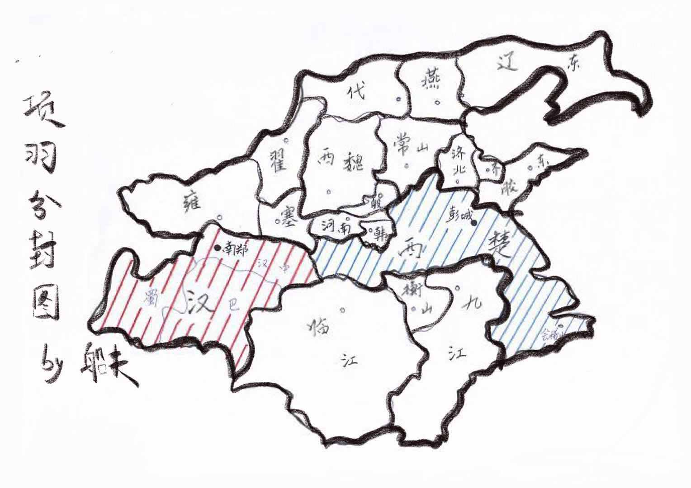
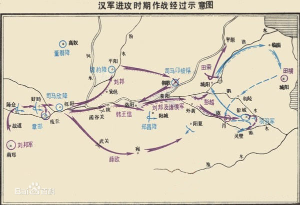
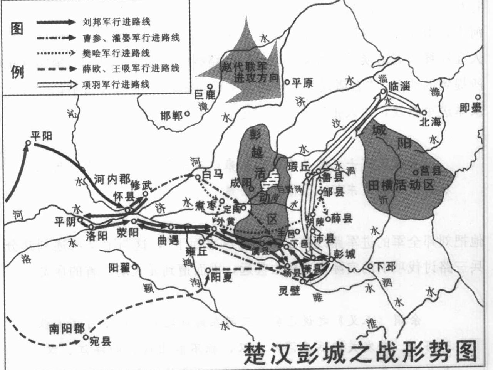
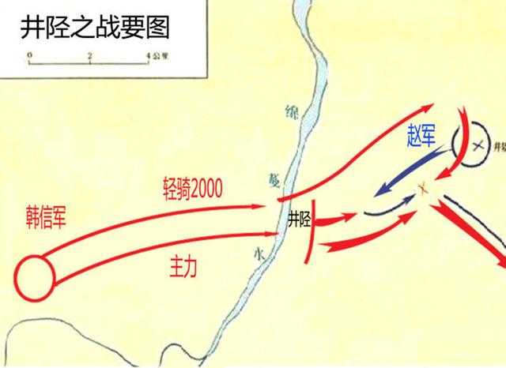
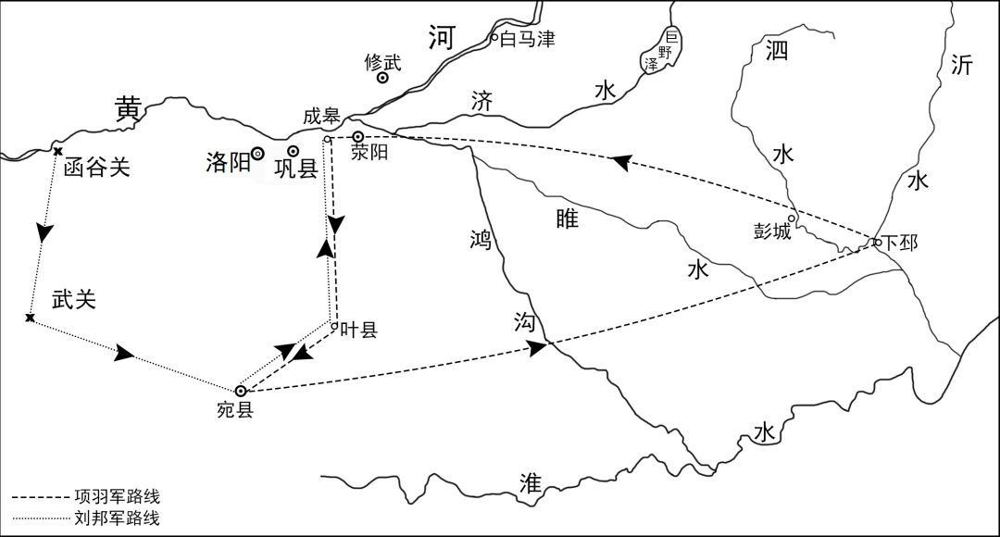
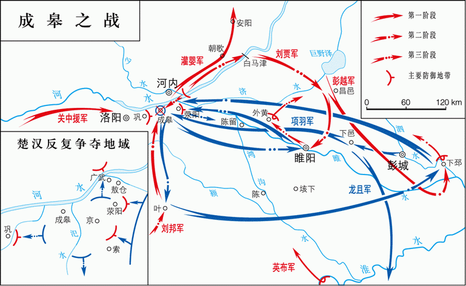
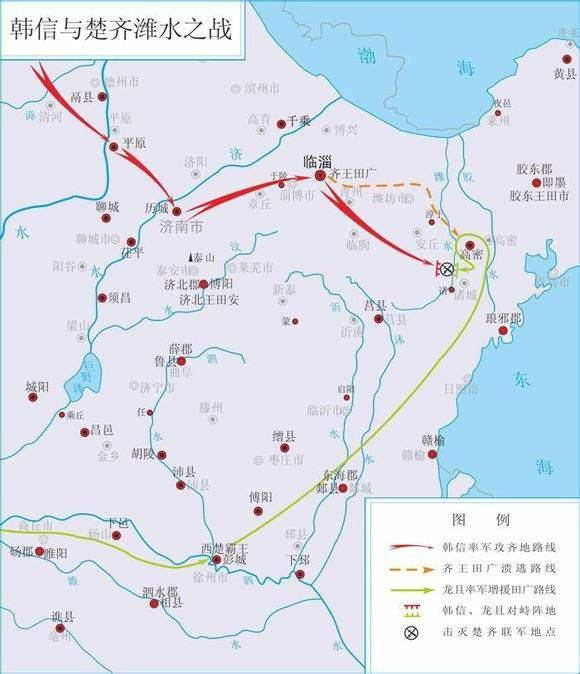
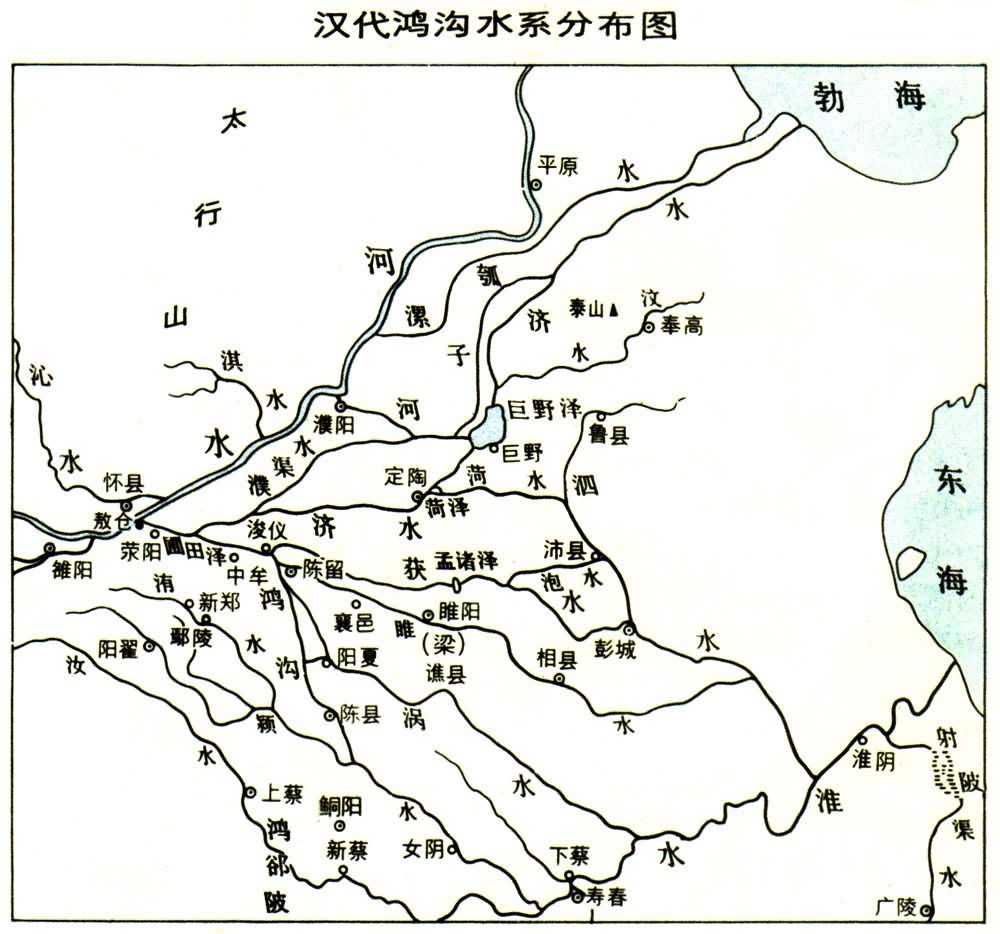
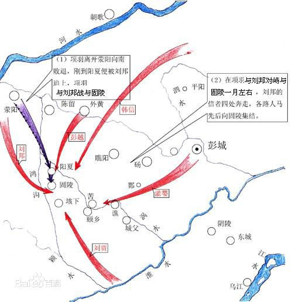
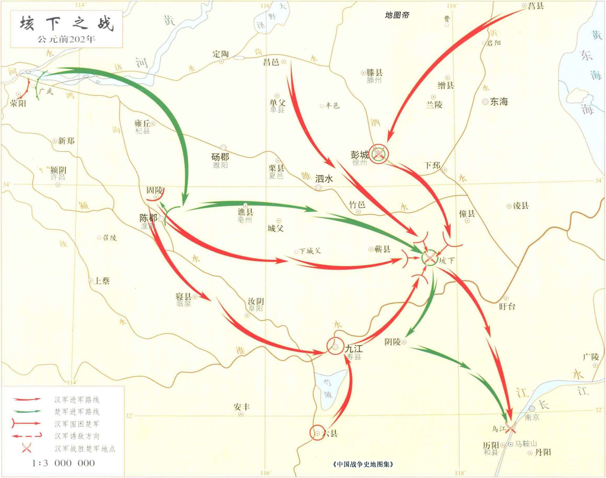

## 子婴投降

（太祖高皇帝元年 前 206 年）冬，十月，沛公至霸上。秦王子婴素车、白马，系颈以组，封皇帝玺、符、节，降轵道旁。诸将或言诛秦王。沛公曰：__「始怀王遣我，固以能宽容。且人已降，杀之不祥。」__ 乃以属吏。

> 贾谊论曰：秦以区区之地致万乘之权，招八州而朝同列，百有余年，然后以六合为家，殽、函为宫。一夫作难而七庙堕，身死人手，为天下笑者，何也？仁谊不施而攻守之势异也。

---

## 约法三章

沛公西入咸阳，诸将皆争走金帛财物之府分之。萧何独先入收秦丞相府图籍藏之，以此沛公得具知天下 厄塞、户口多少、强弱之处。沛公见秦宫室、帷帐、狗马、重宝、妇女以千数，意欲留居之。樊哙谏曰：__「沛公欲有天下耶，将为富家翁耶？凡此奢丽之物，皆秦所以亡也，沛公何用焉！愿急还霸上，无留宫中！」__ 沛公不听。张良曰：__「秦为无道，故沛公得至此。夫为天下除残贼，宜缟素为资。今始入秦，即安其乐，此所谓‘助桀为虐’。且忠言逆耳利于行，毒药苦口利于病，愿沛公听樊哙言！」__ 沛公乃还军霸上。十一月，沛公悉召诸县父老、豪桀，谓曰：__「父老苦秦苛法久矣！吾与诸侯约，先入关者王之，吾当王关中。与父老约法三章耳：杀人者死，伤人及盗抵罪。余悉除去秦法，诸吏民皆案堵如故。凡吾所以来，为父老除害，非有所侵暴，无恐。且吾所以还军霸上，待诸侯至而定约束耳。」__ 乃使人与秦吏行县、乡、邑，告谕之。秦民大喜。争持牛、羊、酒食献飨军士。沛公又让不受，曰：__「仓粟多，非乏，不欲费民。」__ 民又益喜，唯恐沛公不为秦王。

---

## 鸿门宴

沛公旦日从百余骑来见项羽鸿门，谢曰：__「臣与将军戮力而攻秦，将军战河北，臣战河南。不自意能先入关破秦，得复见将军于此。今者有小人之言，令将军与臣有隙。」__ 项羽曰：__「此沛公左司马曹无伤言之，不然，籍何以生此！」__ 项羽因留沛公与饮。范增数目项羽，举所佩玉 夬以示之者三。项羽默然不应。范增起，出，召项庄，谓曰：__「君王为人不忍。若入前为寿，寿毕，以剑舞，因击沛公于坐，杀之。不者，若属皆且为所虏！」__ 庄则入为寿，寿毕，曰：__「军中无以为乐，请以剑舞。」__ 项羽曰：__「诺。」__ 项庄拔剑起舞。项伯亦拔剑起舞，常以身翼蔽沛公，庄不得击。于是张良至军门见樊哙。哙曰：__「今日之事何如？」__ 良曰：__「今项庄拔剑舞，其意常在沛公也。」__ 哙曰：__「此迫矣，臣请入，与之同命！」__ 哙即带剑拥盾入。军门卫士欲止不内，樊哙侧其盾以撞，卫士仆地。遂入，披帷立， 真目视项羽，头发上指，目眦尽裂。项羽按剑而跽曰：__「客何为者？」__ 张良曰：__「沛公之参乘樊哙也。」__ 项羽曰：__「壮士！赐之卮酒！」__ 则与斗卮酒。哙拜谢，起，立而饮之。项羽曰：__「赐之彘肩！」__ 则与一生彘肩。樊哙覆其盾于地，加彘肩其上，拔剑切而啖之。项羽曰：__「壮士能复饮乎？」__ 樊哙曰：__「臣死且不避，卮酒安足辞！夫秦有虎狼之心，杀人如不能举，刑人如恐不胜；天下皆叛之。怀王与诸将约曰：‘先破秦入咸阳者，王之。’今沛公先破秦入咸阳，豪毛不敢有所近，还军霸上以待将军。劳苦而功高如此，未有封爵之赏，而听细人之说，欲诛有功之人，此亡秦之续耳，窃为将军不取也！」__ 项羽未有以应，曰：__「坐！」__ 樊哙从良坐。坐须臾，沛公起如厕，因招樊哙出。公曰：__「今者出，未辞也，为之奈何？」__ 樊哙曰：__「如今人方为刀俎，我方为鱼肉，何辞为！」__ 于是遂去。鸿门去霸上四十里，沛公则置车骑，脱身独骑；樊哙、夏侯婴、靳强、纪信等四人持剑、盾步走，从骊山下道芷阳，间行趣霸上。留张良使谢项羽，以白璧献羽，玉斗与亚父。沛公谓良曰：__「从此道至吾军，不过二十里耳。度我至军中，公乃入。」__ 沛公已去，间至军中，张良入谢曰：__「沛公不胜杯杓，不能辞，谨使臣良奉白璧一双，再拜献将军足下；玉斗一双，再拜奉亚父足下。」__ 项羽曰：__「沛公安在？」__ 良曰：__「闻将军有意督过之，脱身独去，已至军矣。」__ 项羽则受璧，置之坐上。亚父受玉斗，置之地，拔剑撞而破之，曰：__「唉！竖子不足与谋！夺将军天下者，必沛公也。吾属今为之虏矣！」__ 沛公至军，立诛杀曹无伤。

---

## 楚人沐猴而冠耳

居数日，项羽引兵西，屠咸阳，杀秦降王子婴，烧秦宫室，火三月不灭。收其货宝、妇女而东。秦民大失望。韩生说项羽曰：__「关中阻山带河，四塞之地，地肥饶，可都以霸。」__ 项羽见秦宫室皆已烧残破，又心思东归，曰：__「富贵不归故乡，如衣绣夜行，谁知之者！」__ 韩生退曰：__「人言楚人沐猴而冠耳，果然！」__ 项羽闻之，烹韩生。

---

## 西楚霸王

二月，羽分天下王诸将。羽自立为西楚霸王，王梁、楚地九郡，都彭城。羽与范增疑沛公，而业已讲解，又恶负约，乃阴谋曰：__「巴、蜀道险，秦之迁人皆居之。」__ 乃曰：__「巴、蜀亦关中地也。」__ 故立沛公为 _汉王_，王巴、蜀、汉中，都南郑。而三分关中，王秦降将，以距塞汉路。章邯为 _雍王_，王咸阳以西，都废丘。长史欣者，故为栎阳狱掾，尝有德于项梁；都尉董翳者，本劝章邯降楚。故立欣为 _塞王_，王咸阳以东，至河，都栎阳；立翳为 _翟王_，王上郡，都高奴。项羽欲自取梁地，乃徙魏王豹为 _西魏王_，王河东，都平阳。瑕丘申阳者，张耳嬖臣也，先下河南郡，迎楚河上，故立申阳为 _河南王_，都洛阳。韩王成因故都，都阳翟。赵将司马卬定河内，数有功，故立卬为 _殷王_，王河内，都朝歌。徙赵王歇为 _代王_。

---

## 韩信胯下之辱

初，淮阴人韩信，家贫，无行，不得推择为吏，又不能治生商贾，常从人寄食饮，人多厌之。信钓于城下，有漂母见信饥，饭信。信喜，谓漂母曰：__「吾必有以重报母。」__ 母怒曰：__「大丈夫不能自食，吾哀王孙而进食，岂望报乎！」__ 淮阴屠中少年有侮信者曰：__「若虽长大，好带刀剑，中情怯耳。」__ 因众辱之曰：__「信能死，刺我；不能死，出我袴下！」__ 于是信孰视之，俛出袴下，蒲伏。一市人皆笑信，以为怯。及项梁渡淮，信杖剑从之。居麾下，无所知名。项梁败，又属项羽，羽以为郎中。数以策干羽，羽不用。汉王之入蜀，信亡楚归汉，未知名。为连敖，坐当斩。其辈十三人皆已斩，次至信，信乃仰视，适见滕公，曰：__「上不欲就天下乎？何为斩壮士？」__ 滕公奇其言，壮其貌，释而不斩。与语，大说之，言于王。王拜以为治粟都尉，亦未之奇也。

---

## 萧何月下追韩信

信数与萧何语，何奇之。汉王至南郑，诸将及士卒皆歌讴思东归，多道亡者。信度何等已数言王，王不我用，即亡去。何闻信亡，不及以闻，自追之。人有言王曰：__「丞相何亡。」__ 王大怒，如失左右手。居一二日，何来谒王。王且怒且喜，骂何曰：__「若亡，何也？」__ 何曰：__「臣不敢亡也，臣追亡者耳。」__ 王曰：__「若所追者谁？」__ 何曰：__「韩信也。」__ 王复骂曰：__「诸将亡者以十数，公无所追。追信，诈也！」__ 何曰：__「诸将易得耳。至如信者，国士无双。王必欲长王汉中，无所事信，必欲争天下，非信无可与计事者。顾王策安所决耳。」__ 王曰：__「吾亦欲东耳，安能郁郁久居此乎！」__ 何曰：__「计必欲东，能用信，信即留；不能用信，终亡耳。」__ 王曰：__「吾为公以为将。」__ 何曰：__「虽为将，信不留。」__ 王曰：__「以为大将。」__ 何曰：__「幸甚！」__ 于是王欲召信拜之。何曰：__「王素慢无礼。今拜大将，如呼小儿，此乃信所以去也。王必欲拜之，择良日，斋戒，设坛场，具礼，乃可耳。」__ 王许之。诸将皆喜，人人各自以为得大将。至拜大将，乃韩信也，一军皆惊。

---

## 韩信分析局势

信拜礼毕，上坐。王曰：__「丞相数言将军，将军何以教寡人计策？」__ 信辞谢，因问王曰：__「今东乡争权天下，岂非项王耶？」__ 汉王曰：__「然。」__ 曰：__「大王自料勇悍仁强孰与项王？」__ 汉王默然良久，曰：__「不如也。」__ 信再拜贺曰：__「惟信亦以为大王不如也。然臣尝事之，请言项王之为人也。项王暗恶叱咤，千人皆废，然不能任属贤将，此特匹夫之勇耳。项王见人，恭敬慈爱，言语呕呕，人有疾病，涕泣分食饮；至使人，有功当封爵者，印刓敝，忍不能予，此所谓妇人之仁也。项王虽霸天下而臣诸侯，不居关中而都彭城；背义帝之约，而以亲爱王诸侯，不平；逐其故主而王其将相，又迁逐义帝置江南；所过无不残灭，百姓不亲附，特劫于威强耳。名虽为霸，实失天下心，故其强易弱。今大王诚能反其道，任天下武勇，何所不诛！以天下城邑封功臣，何所不服！以义兵从思东归之士，何所不散！且三秦王为秦将，将秦子弟数岁矣，所杀亡不可胜计；又欺其众降诸侯，至新安，项王诈坑秦降卒二十余万，唯独邯、欣、翳得脱。秦父兄怨此三人，痛入骨髓。今楚强以威王此三人，秦民莫爱也。大王之入武关，秋毫无所害；除秦苛法，与秦民约法三章；秦民无不欲得大王王秦者。于诸侯之约，大王当王关中，民咸知之；大王失职入汉中，秦民无不恨者。今大王举而东，三秦可传檄而定也。」__ 于是汉王大喜，自以为得信晚，遂听信计，部署诸将所击。留萧何收巴、蜀租，给军粮食。

---

## 平定三秦

八月，汉王引兵从故道出（雍军塞渭上，上计欲还，[赵]衍言从它道，道通），袭雍；雍王章邯迎击汉陈仓。雍兵败，还走；止，战好畤，又败，走废丘。汉王遂定雍地，东至咸阳，引兵围雍王于废丘，而遣诸将略地。塞王欣、翟王翳皆降，以其地为渭南、河上、上郡。将军薛欧、王吸出武关，因王陵兵以迎太公、吕后。项王闻之，发兵距之阳夏，不得前。王陵者，沛人也，先聚党数千人，居南阳，至是始以兵属汉。项王取陵母置军中，陵使至，则东乡坐陵母，欲以招陵。陵母私送使者，泣曰：__「愿为老妾语陵：善事汉王，汉王长者，终得天下，毋以老妾故持二心。妾以死送使者！」__ 遂伏剑而死。项王怒。烹陵母。

---

## 项羽杀义帝

（太祖高皇帝二年 前 205 年）冬，十月，项王密使九江、衡山、临江王击义帝，杀之江中。

---

## 陈平归汉王

初，阳武人陈平，家贫，好读书。里中社，平为宰，分肉食甚均。父老曰：__「善，陈孺子之为宰！」__ 平曰：__「嗟乎，使平得宰天下，亦如是肉矣！」__ 及诸侯叛秦，平事魏王咎于临济，为太仆，说魏王，不听。人或谗之，平亡去。后事项羽，赐爵为卿。殷王反楚，项羽使平击降之。还，拜为都尉，赐金二十镒。居无何，汉王攻下殷。项王怒，将诛定殷将吏。平惧，乃封其金与印，使使归项王；而挺身间行，杖剑亡，渡河，归汉王于修武，因魏无知求见汉王。汉王召入，赐食，遣罢就舍。平曰：__「臣为事来，所言不可以过今日。」__ 于是汉王与语而说之。问曰：__「子之居楚何官？」__ 曰：__「为都尉。」__ 是日，即拜平为都尉，使为参乘，典护军。诸将尽讙曰：__「大王一日得楚之亡卒，未知其高下，而即与同载，反使监护长者！」__ 汉王闻之，愈益幸平。

---

## 楚汉彭城之战

田荣弟横收散卒，得数万人，起城阳，夏，四月，立荣子广为齐王，以拒楚。项王因留，连战，未能下。虽闻汉东，既击齐，欲遂破之而后击汉，汉王以故得率诸侯兵凡五十六万人伐楚。到外黄，彭越将其兵三万余人归汉。汉王曰：__「彭将军收魏地得十余城，欲急立魏后。今西魏王豹，真魏后。」__ 乃拜彭越为魏相国，擅将其兵略定梁地。汉王遂入城，收其货宝、美人，日置酒高会。项王闻之，令诸将击齐，而自以精兵三万人南，从鲁出胡陵至萧。晨，击汉军而东至彭城，日中，大破汉军。汉军皆走，相随入谷、泗水，死者十余万人。汉卒皆南走山，楚又追击至灵壁东睢水上；汉军却，为楚所挤，卒十余万人皆入睢水，水为之不流。围汉王三匝。

---

## 滕公救二子

会大风从西北起，折木，发屋，扬沙石，窈冥昼晦，逢迎楚军，大乱坏散，而汉王乃得与数十骑遁去。欲过沛收家室，而楚亦使人之沛取汉王家。家皆亡，不与汉王相见。汉王道逢孝惠、鲁元公主，载以行。楚骑追之，汉王急，推堕二子车下。滕公为太仆，常下收载之。如是者三，曰：__「今虽急，不可以驱，奈何弃之！」__ 故徐行。汉王怒，欲斩之者十余；滕公卒保护，脱二子。审食其从太公、吕后间行求汉王，不相遇，反遇楚军。楚军与归，项王常置军中为质。

---

## 京索之战

五月，汉王至荥阳，诸败军皆会，萧何亦发关中老弱未傅者悉诣荥阳，汉军复大振。楚起于彭城，常乘胜逐北，与汉战荥阳南京、索间。楚骑来众，汉王择军中可为骑将者，皆推故奉骑士重泉人李必、骆甲。汉王欲拜之，必、甲曰：__「臣故秦民，恐军不信；愿得大王左右善骑者傅之。」__ 乃拜灌婴为中大夫令，李必、骆甲为左右校尉，将骑兵击楚骑于荥阳东，大破之，楚以故不能过荥阳而西。汉王军荥阳，筑甬道属之河，以取敖仓粟。

---

## 用人：能与行

周勃、灌婴等言于汉王曰：__「陈平虽美如冠玉，其中未必有也。臣闻平居家时盗其嫂；事魏不容，亡归楚；不中，又亡归汉。今日大王尊官之，令护军。臣闻平受诸将金，金多者得善处，金少者得恶处。平，反覆乱臣也，愿王察之！」__ 汉王疑之，召让魏无知。无知曰：__「臣所言者能也，陛下所问者行也。今有尾生、孝己之行，而无益胜负之数，陛下何暇用之乎！楚、汉相距，臣进奇谋之士，顾其计诚足以利国家不耳。盗嫂、受金，又何足疑乎！」__ 汉王召让平曰：__「先生事魏不中，事楚而去，今又从吾游，信者固多心乎！」__ 平曰：__「臣事魏王，魏王不能用臣说，故去；事项王，项王不能信人，其所任爱，非诸项，即妻之昆弟，虽有奇士不能用。闻汉王能用人，故归大王。臣裸身来，不受金无以为资。诚臣计画有可采乎，愿大王用之；使无可用者，金具在，请封输官，得其骸骨。」__ 汉王乃谢，厚赐，拜为护军中尉，尽护诸将。诸将乃不敢复言。

---

## 韩信平魏地

汉王以韩信为左丞相，与灌婴、曹参俱击魏。汉王问食其：__「魏大将谁也？」__ 对曰：__「柏直。」__ 王曰：__「是口尚乳臭，安能当韩信！骑将谁也？」__ 曰：__「冯敬。」__ 曰：__「是秦将冯无择子也，虽贤，不能当灌婴。」__ __「步卒将谁也？」__ 曰：__「项佗。」__ 曰：__「不能当曹参。吾无患矣！」__ 韩信亦问郦生：__「魏得无用周叔为大将乎？」__ 郦生曰：__「柏直也。」__ 信曰：__「竖子耳。」__ 遂进兵。魏王盛兵蒲坂以塞临晋。信乃益为疑兵，陈船欲渡临晋，而伏兵从夏阳以木罂流军，袭安邑。魏王豹惊，引兵迎信。九月，信击虏豹，传诣荥阳；悉定魏地，置河东、上党、太原郡。

---

## 井陉之战

（太祖高皇帝三年 前 204 年）冬，十月，韩信、张耳以兵数万东击赵。赵王及成安君陈余闻之，聚兵井陉口，号二十万。

广武君李左车说成安君曰：__「韩信、张耳乘胜而去国远斗，其锋不可当。臣闻‘千里馈粮，士有饥色；樵苏后爨(cuàn)，师不宿饱。’今井陉之道，车不得方轨，骑不得成列；行数百里，其势粮食必在其后。愿足下假臣奇兵三万人，从间路绝其辎重；足下深沟高垒勿与战。彼前不得斗，退不得还，野无所掠，不至十日，而两将之头可致于麾下；否则必为二子所擒矣。」__ 成安君尝自称义兵，不用诈谋奇计，曰：__「韩信兵少而疲，如此避而不击，则诸侯谓吾怯而轻来伐我矣。」__ 韩信使人间视，知其不用广武君策，则大喜，乃敢引兵遂下。未至井陉口三十里，止舍。夜半，传发，选轻骑二千人，人持一赤帜，从间道萆(bēi)山而望赵军。诫曰：__「赵见我走，必空壁逐我；若疾入赵壁，拔赵帜，立汉赤帜。」__ 令其裨将传餐，曰：__「今日破赵会食！」__ 诸将皆莫信，佯应曰：__「诺。」__ 信曰：__「赵已先据便地为壁；且彼未见吾大将旗鼓，未肯击前行，恐吾至阻险而还也。」__ 乃使万人先行，出，背水陈。赵军望见而大笑。平旦，信建大将旗鼓，鼓行出井陉口；赵开壁击之，大战良久。于是信与张耳佯弃鼓旗，走水上军；水上军开入之，复疾战。赵果空壁争汉旗、鼓，逐信、耳。信、耳已入水上军，军皆殊死战，不可败。信所出奇兵二千骑共候赵空壁逐利，则驰入赵壁，皆拔赵旗，立汉赤帜二千。赵军已不能得信等，欲还归壁；壁皆汉赤帜，见而大惊，以为汉皆已得赵王将矣，兵遂乱，遁走，赵将虽斩之，不能禁也。于是汉兵夹击，大破赵军，斩成安君泜水上，禽赵王歇。诸将效首虏，毕贺，因问信曰：__「兵法：‘右倍山陵，前左水泽。’今者将军令臣等反背水陈，曰‘破赵会食’，臣等不服，然竟以胜，此何术也？」__ 信曰：__「此在兵法，顾诸君不察耳！兵法不曰‘陷之死地而后生，置之亡地而后存’？且信非得素拊循士大夫也，此所谓‘驱市人而战之’，其势非置之死地，使人人自为战。今予之生地，皆走，宁尚可得而用之乎？！」__ 诸将皆服，曰：__「善！非臣所及也。」__

---

## 汉王踞床洗足见英布

楚使项声、龙且攻九江，数月，龙且破九江军。布欲引兵走汉，恐楚兵杀之，乃间行与何俱归汉。十二月，九江王至汉。汉王方踞床洗足，召布入见。布大怒，悔来，欲自杀；及出就舍，帐御、饮食、从官皆如汉王居，布又大喜过望。于是乃使人入九江；楚已使 __项伯__ 收九江兵，尽杀布妻子，布使者颇得故人、幸臣，将众数千人归汉。汉益九江王兵，与俱屯成皋。

> （秦纪三 二世皇帝三年 前 207 年）沛公至高阳传舍，使人召郦生。郦生至，入谒。沛公方倨床使两女子洗足，而见郦生。郦生入，则长揖不拜，曰：__「足下欲助秦攻诸侯乎？且欲率诸侯破秦也？」__ 沛公骂曰：__「竖儒！天下同苦秦久矣，故诸侯相率而攻秦，何谓助秦攻诸侯乎！」__ 郦生曰：__「必聚徒合义兵诛无道秦，不宜倨见长者！」__ 于是沛公辍洗，起，摄衣，延郦生上坐，谢之。（成语「吐哺辍洗」）

---

## 竖儒几败而公事 - 高祖差一点分封六国后人

楚数侵夺汉甬道，汉军乏食。汉王与郦食其谋桡楚权。食其曰：「昔汤伐桀，封其后于杞；武王伐纣，封其后于宋。今秦失德弃义，侵伐诸侯，灭其社稷，使无立锥之地，陛下诚能复立六国之后，此其君臣、百姓必皆戴陛下之德，莫不乡风慕义，愿为臣妾。德义已行，陛下南乡称霸，楚必敛衽而朝。」 汉王曰：「善！趣刻印，先生因行佩之矣。」 食其未行，张良从外来谒。汉王方食，曰：「子房前！客有为我计桡楚权者。」 具以郦生语告良，曰：「何如？」 良曰：「谁为陛下画此计者？陛下事去矣！」 汉王曰：「何哉？」 对曰：「臣请借前箸，为大王筹之。昔汤、武封桀、纣之后者，度能制其死生之命也；今陛下能制项籍之死命乎？其不可一也。武王入殷，表商容之闾，释箕子之囚，封比干之墓，今陛下能乎？其不可二也。发巨桥之粟，散鹿台之钱，以赐贫穷，今陛下能乎？其不可三也。殷事已毕，偃革为轩，倒载干戈，示天下不复用兵，今陛下能乎？其不可四也。休马华山之阳，示以无为，今陛下能乎？其不可五也。放牛桃林之阴，以示不复输积，今陛下能乎？其不可六也。天下游士，离其亲戚，弃坟墓，去故旧，从陛下游者，徒欲日夜望咫尺之地；今复立六国之后，天下游士各归事其主，从其亲戚，反其故旧、坟墓，陛下与谁取天下乎？其不可七也。且夫楚唯无强，六国立者复桡而从之，陛下焉得而臣之？其不可八也。诚用客之谋，陛下事去矣！」 汉王辍食，吐哺，骂曰：「竖儒几败而公事！」 令趣销印。

---

## 权不可豫设，变不可先图

> 伐赵之役，韩信军于泜水之上而赵不能败。彭城之难，汉王战于睢水之上，士卒皆赴入睢水而楚兵大胜。何则？赵兵出国迎战，见可而进，知难而退，怀内顾之心，无出死之计；韩信军孤在水上，士卒必死，无有二心，此信之所以胜也。汉王深入敌国，置酒高会，士卒逸豫，战心不固；楚以强大之威而丧其国都，士卒皆有愤激之气，救败赴亡之急，以决一旦之命，此汉之所以败也。且韩信选精兵以守，而赵以内顾之士攻之；项羽选精兵以攻，而汉以怠惰之卒应之，此同事而异情者也。
>
> 故曰：权不可豫设，变不可先图。与时迁移，应物变化，设策之机也。

---

## 荥阳之战：亚父被反间悲郁而死

夏，四月，楚围汉王于荥阳，急；汉王请和，割荥阳以西者为汉。亚父劝羽急攻荥阳；汉王患之。项羽使使至汉，陈平使为太牢具。举进，见楚使，即佯惊曰：__「吾以为亚父使，乃项王使！」__ 复持去，更以恶草具进楚使。楚使归，具以报项王，项王果大疑亚父。亚父欲急攻下荥阳城，项王不信，不肯听。亚父闻项王疑之，乃怒曰：__「天下事大定矣，君王自为之，愿请骸骨！」__ 归，未至彭城，疽发背而死。

---

## 纪信诳项以免君

五月，将军纪信言于汉王曰：「事急矣！臣请诳楚，王可以间出。」 于是陈平夜出女子东门二千余人，楚因而四面击之。纪信乃乘王车，黄屋左纛，曰：「食尽，汉王降楚。」 楚皆呼万岁，之城东观。以故汉王得与数十骑出西门遁去，令韩王信与周苛、魏豹、枞公守荥阳。羽见纪信，问：「汉王安在？」 曰：「已出去矣。」 羽烧杀信。

> 纪信生降为沛公，草荒孤垒想英风。汉家青史缘何事，却道萧何第一功。

---

## 成皋之战

（太祖高皇帝四年 前 203 年）彭越攻徇梁地，下睢阳、外黄等十七城。九月，项王谓大司马曹咎曰：__「谨守成皋。即汉王欲挑战，慎勿与战，勿令得东而已。我十五日必定梁地，复从将军。」__ 羽引兵东行，击陈留、外黄、睢阳等城，皆下之。

楚大司马咎守成皋，汉数挑战，楚军不出。使人辱之，数日，咎怒，渡兵汜水。士卒半渡，汉击之，大破楚军，尽得楚国金玉、货赂，咎及司马欣皆自刭汜水上。汉王引兵渡河，复取成皋，军广武，就敖仓食。

---

## 汉王数羽之罪

汉王使人间问之，乃项王也，汉王大惊。于是项王乃即汉王，相与临广武间而语。羽欲与汉王独身挑战。汉王数羽曰：__「羽负约，王我于蜀、汉，罪一；矫杀卿子冠军，罪二；救赵不还报，而擅劫诸侯兵入关，罪三；烧秦宫室，掘始皇帝冢，收私其财，罪四；杀秦降王子婴，罪五；诈坑秦子弟新安二十万，罪六；王诸将善地而徙逐故主，罪七；出逐义帝彭城，自都之，夺韩王地，并王梁、楚，多自与，罪八；使人阴杀义帝江南，罪九；为政不平，王约不信，天下所不容，大逆无道，罪十也。吾以义兵从诸侯诛残贼，使刑余罪人击公，何苦乃与公挑战！」__ 羽大怒，伏弩射中汉王。汉王伤胸，乃扪足曰：__「虏中吾指。」__ 汉王病创卧，张良强请汉王起行劳军，以安士卒，毋令楚乘胜。汉王出行军，疾甚，因驰入成皋。韩信已定临淄，遂东追齐王。

---

## 潍水之战

项王使龙且将兵，号二十万，以救齐，与齐王合军高密。客或说龙且曰：__「汉兵远斗穷战，其锋不可当。齐、楚自居其地，兵易败散。不如深壁，令齐王使其信臣招所亡城；亡城闻王在，楚来救，必反汉。汉兵二千里客居齐地，齐城皆反之，其势无所得食，可无战而降也。」__ 龙且曰：__「吾平生知韩信为人，易与耳！寄食于漂母，无资身之策；受辱于袴下，无兼人之勇，不足畏也。且夫救齐，不战而降之，吾何功！今战而胜之，齐之半可得也。」__ 十一月，齐、楚与汉夹潍水而陈。韩信储夜令人为万余囊，满盛沙，壅水上流；引军半渡击龙且，佯不胜，还走。龙且果喜曰：__「固知信怯也！」__ 遂追信。信使人决壅囊，水大至，龙且军太半不得渡。即急击杀龙且，水东军散走，齐王广亡去。信遂追北至成阳，虏齐王广。

---

## 分封韩信为齐王

韩信使人言汉王曰：__「齐伪诈多变，反覆之国也；南边楚。请为假王以镇之。」__ 汉王发书，大怒，骂曰：__「吾困于此，旦暮望若来佐我，乃欲自立为王！」__ 张良、陈平蹑汉王足，因附耳语曰：__「汉方不利，宁能禁信之自王乎！不如因而立之，善遇，使自为守。不然，变生。」__ 汉王亦悟，因复骂曰：__「大丈夫定诸侯，即为真王耳，何以假为！」__ 春，二月，遣张良操印立韩信为齐王，征其兵击楚。

---

## 蒯彻说韩信三分天下鼎足而立

武涉已去，蒯彻知天下权在信，乃以相人之术说信曰：__「仆相君之面，不过封侯，又危不安；相君之背，贵乃不可言。」__ 韩信曰：__「何谓也？」__ 蒯彻曰：__「天下初发难也，忧在亡秦而已。今楚、汉分争，使天下之人肝胆涂地，父子暴骸骨于中野，不可胜数。楚人起彭城，转斗逐北，乘利席卷，威震天下；然兵困于京、索之间，迫西山而不能进者，三年于此矣。汉王将数十万之众，距巩、雒，阻山河之险，一日数战，无尺寸之功，折北不救。此所谓智勇俱困者也。百姓罢极怨望，无所归倚。以臣料之，其势非天下之贤圣固不能息天下之祸。当今两主之命，县于足下，足下为汉则汉胜，与楚则楚胜。诚能听臣之计，莫若两利而俱存之，参分天下，鼎足而居，其势莫敢先动。夫以足下之贤圣，有甲兵之聚，据强齐，从赵、燕，出空虚之地而制其后，因民之欲，西乡为百姓请命，则天下风走而响应矣，孰敢不听！割大弱强以立诸侯，诸侯已立，天下服听，而归德于齐。案齐之故，有胶、泗之地，深拱揖让，则天下之君王相率而朝于齐矣。盖闻‘_天与弗取，反受其咎；时至不行，反受其殃_’。愿足下熟虑之！」__ 韩信曰：__「汉王遇我甚厚，吾岂可乡利而倍义乎！」__ 蒯生曰：__「始常山王、成安君为布衣时，相与为刎颈之交；后争张黡、陈泽之事，常山王杀成安君泜水之 南，头足异处。此二人相与，天下至欢也，然而卒相禽者，何也？患生于多欲而人心难测也。今足下欲行忠信以交于汉王，必不能固于二君之相与也，而事多大于张黡(yǎn)、陈泽者；故臣以为足下必汉王之不危己，亦误矣！大夫种存亡越，霸句践，立功成名而身死亡，野兽尽而猎狗烹。夫以交友言之，则不如张耳之与成安君者也；以忠信言之，则不过大夫种之于句践也，此二者足以观矣！愿足下深虑之。且臣闻‘勇略震主者身危，功盖天下者不赏’。今足下戴震主之威，挟不赏之功，归楚，楚人不信；归汉，汉人震恐。足下欲持是安归乎？」__ 韩信谢曰：__「先生且休矣，吾将念。」__ 后数日，蒯彻复说曰：__「夫听者，事之候也；计者，事之机也；听过计失而能久安者鲜矣！_故知者，决之断也；疑者，事之害也_。审豪厘之小计，遗天下之大数，智诚知之，决弗敢行者，百事之祸也。_夫功者，难成而易败；时者，难得而易失也_；时乎时，不再来！」__ 韩信犹豫，不忍倍汉；又自以功多，汉终不夺我齐，遂谢。蒯彻因去，佯狂为巫。

---

## 鸿沟之盟与养虎自患

项羽自知少助；食尽，韩信又进兵击楚，羽患之。汉遣侯公说羽请太公。羽乃与汉约，中分天下，割洪沟以西为汉，以东为楚。九月，楚归太公、吕后，引兵解而东归。汉王欲西归，张良、陈平说曰：__「汉有天下太半，而诸侯皆附；楚兵疲食尽，此天亡之时也。今释弗击，此所谓养虎自遗患也。」__ 汉王从之。

---

## 固陵之战

（太祖高皇帝五年 前 202 年）冬，十月，汉王追项羽至固陵，与齐王信、魏相国越期会击楚；信、越不至，楚击汉军，大破之。汉王复坚壁自守，谓张良曰：__「诸侯不从，奈何？」__ 对曰：__「楚兵且破，二人未有分地，其不至固宜。君王能与共天下，可立致也。齐王信之立，非君王意，信亦不自坚；彭越本定梁地，始，君王以魏豹故拜越为相国，今豹死，越亦望王，而君王不早定。今能取睢阳以北至谷城皆以王彭越，从陈以东傅海与齐王信。信家在楚，其意欲复得故邑。能出捐此地以许两人，使各自为战，则楚易破也。」__ 汉王从之。于是韩信、彭越皆引兵来。

---

## 垓下之战 四面楚歌 十面埋伏

（太祖高皇帝五年 前 202 年）十二月，项王至垓下，兵少，食尽，与汉战不胜，入壁；汉军及诸侯兵围之数重。项王夜闻汉军四面皆楚歌，乃大惊曰：__「汉皆已得楚乎？是何楚人之多也？」__ 则夜起，饮帐中，悲歌慷慨，泣数行下；左右皆泣，莫能仰视。于是项王乘其骏马名骓，麾下壮士骑从者八百余人，直夜，溃围南出驰走。平明，汉军乃觉之，令骑将灌婴以五千骑追之。项王渡淮，骑能属者才百余人。至阴陵，迷失道，问一田父，田父绐曰 __「左」__ 。左，乃陷大泽中，以故汉追及之。项王乃复引兵而东，至东城，乃有二十八骑。汉骑追者数千人，项王自度不得脱，谓其骑曰：__「吾起兵至今，八岁矣；身七十余战，未尝败北，遂霸有天下。然今卒困于此，此天之亡我，非战之罪也。今日固决死，愿为诸君快战，必溃围，斩将，刈旗，三胜之，令诸君知天亡我，非战之罪也。」__

---

## 至今思项羽，不肯过江东

项王笑曰：__「天之亡我，我何渡为！且籍与江东子弟八千人渡江而西，今无一人还；纵江东父兄怜而王我，我何面目见之！纵彼不言，籍独不愧于心乎！」__ 乃以所乘骓马赐亭长，令骑皆下马步行，持短兵接战。独籍所杀汉军数百人，身亦被十余创。顾见汉骑司马吕马童，曰：__「若非吾故人乎？」__ 马童面之，指示中郎骑王翳曰：__「此项王也！」__ 项王乃曰：__「吾闻汉购我头千金，邑万户，吾为若德。」__ 乃刎而死。王翳取其头，余骑相蹂践争项王，相杀者数十人。最其后，杨喜、吕马童及郎中吕胜、杨武各得其一体；五人共会其体，皆是，故分其户，封五人皆为列侯。楚地悉定，独鲁不下；汉王引天下兵欲屠之。至其城下，犹闻弦诵之声，为其守礼义之国，为主死节，乃持项王头以示鲁父兄，鲁乃降。

---

## 太史公，扬子评项羽

> 太史公曰：羽起陇畮之中，三年，遂将五诸侯灭秦，分裂天下而封王侯，政由羽出；位虽不终，近古以来未尝有也！及羽背关怀楚，放逐义帝而自立；怨王侯叛己，难矣！自矜功伐，奋其私智而不师古，谓霸王之业，欲以力征经营天下。五年，卒亡其国，身死东城，尚不觉寤而不自责，乃引 __「天亡我，非用兵之罪也，」__ 岂不谬哉！

扬子《法言》：或问：__「楚败垓下，方死，曰‘天也！’谅乎？」__ 曰：__「汉屈群策，群策屈群力；楚憞群策而自屈其力。屈人者克，自屈者负。天曷故焉！」__

---

## 项羽刘邦

---

## 汉初三杰

帝置酒洛阳南宫，上曰：__「彻侯、诸将毋敢隐朕，皆言其情。吾所以有天下者何？项氏之所以失天下者何？」__ 高起、王陵对曰：__「陛下使人攻城略地，因以与之，与天下同其利；项羽不然，有功者害之，贤者疑之，此其所以失天下也。」__ 上曰：__「公知其一，未知其二。夫运筹帷幄之中，决胜千里之外，吾不如子房；填国家，抚百姓，给饷馈，不绝粮道，吾不如萧何；连百万之众，战必胜，攻必取，吾不如韩信。三者皆人杰，吾能用之，此吾所以取天下者也。项羽有一范增而不能用，此所以为我禽也。」__ 群臣说服。

---

## 和韩信有关的典故

明修栈道，暗渡陈仓、临晋设疑、夏阳偷渡、木罂渡军、背水为营、背水一战、拔帜易帜、传檄而定、沈沙决水、半渡而击、四面楚歌、十面埋伏

胯下之辱，一饭千金，战无不胜，国士无双，多多益善，置之死地而后生，解衣推食，居常鞅鞅，功高震主，金石之交，独当一面，不赏之功，妇人之仁，推陈出新，伐功矜能，伪游云梦，钟室之祸，成也萧何败也萧何，问路斩樵

乘人之车者载人之患，衣人之衣者怀人之忧，食人之食者死人之事

愚者千虑，必有一得；智者千虑，必有一失

---

## 苏武天山上，田横海岛边

彭越既受汉封，田横惧诛，与其徒属五百余人入海，居岛中。帝以田横兄弟本定齐地，齐贤者多附焉；今在海中，不取，后恐为乱。乃使使赦横罪，召之。横谢曰：「臣烹陛下之使郦生，今闻其弟商为汉将；臣恐惧，不敢奉诏，请为庶人，守海岛中。」 使还报，帝乃诏卫尉郦商曰：「齐王田横即至，人马从者敢动摇者，致族夷！」 乃复使使持节具告以诏商状，曰：「田横来，大者王，小者乃侯耳；不来，且举兵加诛焉！」 横乃与其客二人乘传诣洛阳。未至三十里，至尸乡厩置。横谢使者曰：「人臣见天子，当洗沐。」 因此留，谓其客曰：「横始与汉王俱南面称孤；今汉王为天子，而横乃为亡虏，北面事之，其耻固已甚矣。且吾烹人之兄，与其弟并肩而事主，纵彼畏天子之诏不敢动，我独不愧于心乎！且陛下所以欲见我者，不过欲一见吾面貌耳。今斩吾头，驰三十里间，形容尚未能败，犹可观也。」 遂自刭，令客奉其头，从使者驰奏之。帝曰：「嗟乎！起自布衣，兄弟三人更王，岂不贤哉！」 为之流涕，而拜其二客为都尉；发卒二千人，以王者礼葬之。既葬，二客穿其冢傍孔，皆自刭，下从之。帝闻之，大惊。以横客皆贤，余五百人尚在海中，使使召之；至，则闻田死，亦皆自杀。

---

## 首录酂侯忘纪信，不诛项伯戮丁公

初，楚人季布为项籍将，数窘辱帝。项籍灭，帝购求布千金；敢有舍匿，罪三族。布乃髡钳为奴，自卖于朱家。朱家心知其季布也，买置田舍，身之洛阳见藤公，说曰；__「季布何罪！臣各为其主用，职耳；项氏臣岂可尽诛邪？今上始得天下，而以私怨求一人，何示不广也！且以季布之贤，汉求之急，此不北走胡，南走越耳。夫忌壮士以资敌国，此伍子胥所以鞭荆平之墓也。君何不从容为上言之！」__ 滕公待间言于上，如朱家指。上乃赦布，召拜郎中，朱家遂不复见之。布母弟丁公，亦为项羽将，逐窘帝彭城西。短兵接，帝急，顾谓丁公曰：__「两贤相厄哉！」__ 丁公引兵而还。及项王灭，丁公谒见。帝以丁公徇军中，曰：__「丁公为项王臣不忠，使项王失天下者也。」__ 遂斩之，曰：__「使后为人臣无效丁公也！」__

---

## 留侯明哲保身

张良素多病，从上入关，即道引，不食谷，杜门不出，曰：__「家世相韩，及韩灭，不爱万金之资，为韩报雠强秦，天下振动。今以三寸舌为帝者师，封万户侯，此布衣之极，于良足矣。愿弃人间事，欲从赤松子游耳。」__

> 臣光曰：夫生之有死，譬犹夜旦之必然；自古及今，固未尝有超然而独存者也。以子房之明辨达理，足以知神仙之为虚诡矣；然其欲从赤松子游者，其智可知也。夫功名之际，人臣之所难处。如高帝所称者，三杰而已。淮阳诛夷，萧何系狱，非以履盛满而不止耶！故子房托于神仙，遗弃人间，等功名于外物，置荣利而不顾，所谓明哲保身者，子房有焉。

---

## 高祖伪游云梦

（（太祖高皇帝六年 前 201 年））冬，十月，人有上书告楚王信反者。帝以问诸将，皆曰：__「亟发兵，坑竖子耳！」__ 帝默然。又问陈平。陈平曰：__「人上书言信反，信知之乎？」__ 曰：__「不知。」__ 陈平曰：__「陛下精兵孰与楚？」__ 上曰：__「不能过。」__ 平曰：__「陛下诸将，用兵有能过韩信者乎？」__ 上曰：__「莫及也。」__ 平曰：__「今兵不如楚精而将不及，举兵攻之，是趣之战也，窃为陛下危之。」__ 上曰：__「为之奈何？」__ 平曰：__「古者天子有巡狩，会诸侯。陛下第出，伪游云梦，会诸侯于陈。陈，楚之西界；信闻天子以好出游，其势必无事而郊迎谒；谒而陛下因禽之，此特一力士之事耳。」__ 帝以为然，乃发使告诸侯会陈，__「吾将南游云梦。」__ 上因随以行。楚王信闻之，自疑惧，不知所为。或说信曰：__「斩钟离昧以谒上，上必喜，无患。」__ 信从之。十二月，上会诸侯于陈，信持昧首谒上；上令武士缚信，载后车。信曰：__「果若人言：‘狡兔死，走狗烹；飞鸟尽，良弓藏；敌国破，谋臣亡。’天下已定，我固当烹！」__ 上曰：__「人告公反。」__ 遂械系信以归，因赦天下。

---

## 封侯

甲申，始剖符封诸功臣为彻侯。萧何封酂侯，所食邑独多。功臣皆曰：__「臣等身被坚执锐，多者百余战，小者数十合。今萧何未尝有汗马之劳，徒持文墨议论，顾反居臣等上，何也？」__ 帝曰：__「诸君知猎乎？夫猎，追杀兽兔者，狗也；而发纵指示兽处者，人也。今诸君徒能得走兽耳，功狗也；至如萧何，发纵指示，功人也。」__ 群臣皆不敢言。张良为谋臣，亦无战斗功；帝使自择齐三万户。良曰：__「始，臣起下邳，与上会留，此天以臣授陛下。陛下用臣计，幸而时中。臣愿封留足矣，不敢当三万户。」__ 乃封张良为留侯。封陈平为户牖侯。平辞曰：__「此非臣之功也。」__ 上曰：__「吾用先生谋计，战胜克敌，非功而何？」__ 平曰：__「非魏无知，臣安得进？」__ 上曰：__「若子，可谓不背本矣！」__ 乃复赏魏无知。

---

## 高祖咬牙封雍齿

上已封大功臣二十余人，其余日夜争功不决，未得行封。上在洛阳南宫，从复道望见诸将，往往相与坐沙中语。上曰：__「此何语？」__ 留侯曰：__「陛下不知乎？此谋反耳！」__ 上曰：__「天下属安定，何故反乎？」__ 留侯曰：__「陛下起布衣，以此属取天下。今陛下为天子，而所封皆故人所亲爱，所诛皆平生所仇怨。今军吏计功，以天下不足遍封；此属畏陛下不能尽封，恐又见疑平生过失及诛，故即相聚谋反耳。」__ 上乃忧曰：__「为之奈何？」__ 留侯曰：__「上平生所憎、群臣所共知，谁最甚者？」__ 上曰：__「雍齿与我有故怨，数尝窘辱我；我欲杀之，为其功多，故不忍。」__ 留侯曰：__「今急先封雍齿，则群臣人人自坚矣。」__ 于是上乃置酒，封雍齿为什方侯；而急趋丞相、御史定功行封。群臣罢酒，皆喜，曰：__「雍齿尚为侯，我属无患矣！」__

---

## 白登之围

上居晋阳，闻冒顿居代谷，欲击之。使人觇匈奴，冒顿匿其壮士、肥牛马，但见老弱及羸畜。使者十辈来，皆言匈奴可击。上复使刘敬往使匈奴，未还；汉悉兵三十二万北逐之，逾句注。刘敬还，报曰：__「两国相击，此宜夸矜，见所长。今臣往，徒见羸瘠、老弱，此必欲见短，伏奇兵以争利。愚以为匈奴不可击也。」__ 是时，汉兵已业行，上怒，骂刘敬曰：__「齐虏以口舌得官，今乃妄言沮吾军！」__ 械系敬广武。帝先至平城，兵未尽到；冒顿纵精兵四十万骑，围帝于白登七日，汉兵中外不得相救饷。帝用陈平秘计，使使间厚遗阏氏。阏氏谓冒顿曰：__「两主不相困。今得汉地，而单于终非能居之也。且汉主亦有神灵，单于察之！」__ 冒顿与王黄、赵利期，而黄、利兵不来，疑其与汉有谋，乃解围之一角。会天大雾，汉使人往来，匈奴不觉。陈平请令强弩傅两矢，外乡，从解角直出。帝出围，欲驱；太仆滕公固徐行。至平城，汉大军亦到，胡骑遂解去。汉亦罢兵归，令樊哙止定代地。上至广武，赦刘敬，曰：__「吾不用公言，以困平城；吾皆已斩前使十辈矣。」__ 乃封敬二千户为关内侯，号为建信侯。帝南过曲逆，曰：__「壮哉县！吾行天下，独见洛阳与是耳。」__ 乃更封陈平为曲逆侯，尽食之。平从帝征伐，凡六出奇计，辄益封邑焉。

---

---

---

---

---

---

---

---

---

---

---

---

---

---

---

---

---

---

---

---

---

---

---

---

---

---

---

---

---

---

---

---

---

---

---

---

---

---

---

---

---
