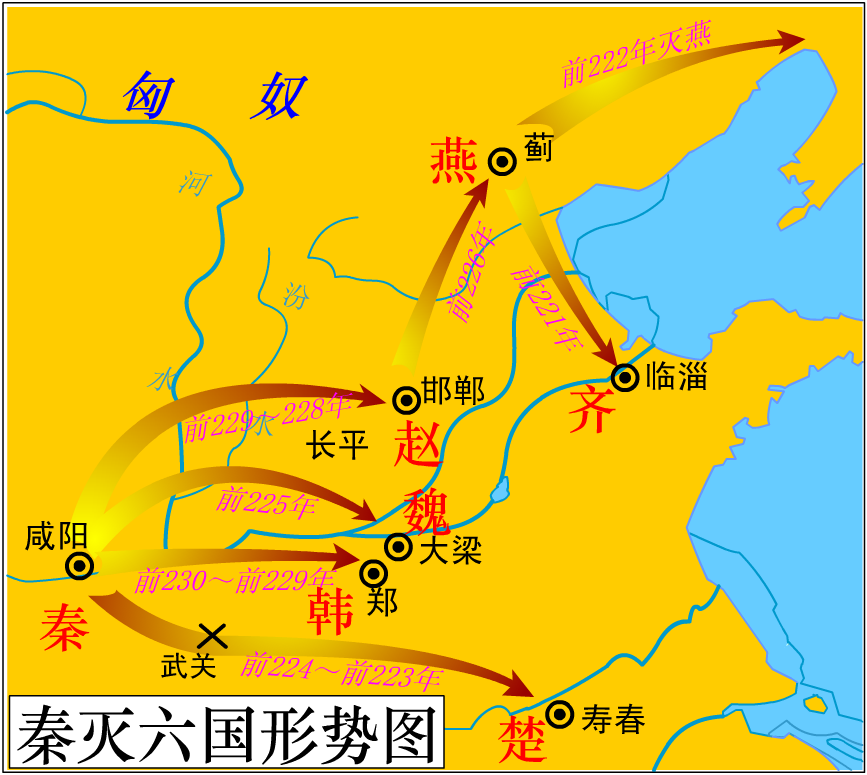
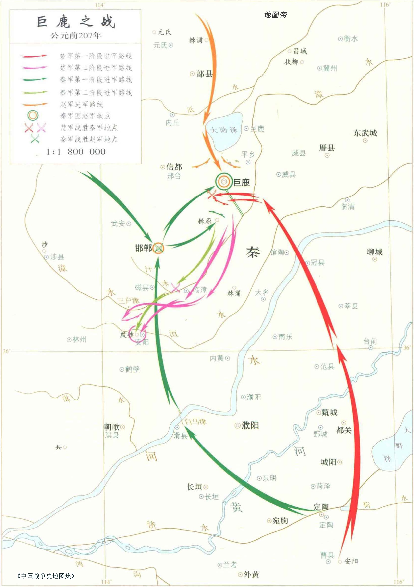
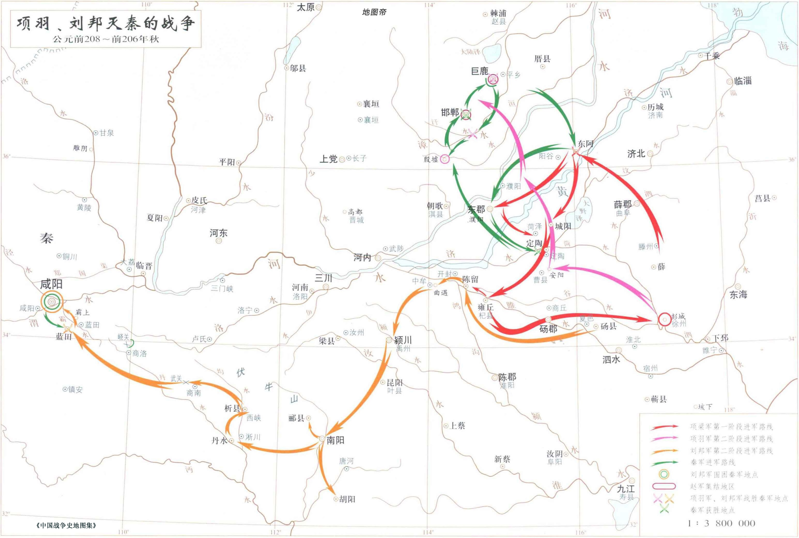

## 日中则移，月满则亏

（秦昭襄王五十二年，前 255 年）河东守王稽坐与诸侯通，弃市。应侯日以不怿。王临朝而叹，应侯请其故。王曰：__「今武安君死，而郑安平、王稽等皆畔，内无良将而外多敌国，吾是以忧。」__ 应侯惧，不知所出。燕客蔡泽闻之，西入秦，先使人宣言于应侯曰：__「蔡泽，天下雄辩之士。彼见王，必困君而夺君之位。」__ 应侯怒，使人召之。蔡泽见应侯，礼又倨。应侯不快，因让之曰：__「子宣言欲代我相，请闻其说。」__ 蔡泽曰：__「吁，君何见之晚也！夫四时之序，成功者去。君独不见夫秦之商君、楚之吴起、越之大夫种，何足愿与？」__ 应侯谬曰：__「何为不可？！此三子者，义之至也，忠之尽也。君子有杀身以成名，死无所恨！」__ 蔡泽曰：__「夫人立功岂不期于成全邪？身名俱全者，上也；名可法而身死者，次也；名戮辱而身全者，下也。夫商君、吴起、大夫种，其为人臣尽忠致功，则可愿矣。闳夭、周公，岂不亦忠且圣乎？！三子之可愿，孰与闳夭、周公哉？」__ 应侯曰：__「善。」__ 蔡泽曰：__「然则君之主惇厚旧故，不倍功臣，孰与孝公、楚王、越王？」__ 曰：__「未知何如。」__ 蔡泽曰：__「君之功能孰与三子？」__ 曰：__「不若。」__ 蔡泽曰：__「然则君身不退，患恐甚于三子矣。语曰：‘日中则移，月满则亏。’进退嬴缩，与时变化，圣人之道也。今君之怨已雠而德已报，意欲至矣而无变计，窃为君危之。」__ 应侯遂延以为上客，因荐于王。王召与语，大悦，拜为客卿。应侯因谢病免。王新悦蔡泽计画，遂以为相国，泽为相数月，免。

---

## 荀子论将

孝成王、临武君曰：__「善。请问为将。」__ 荀卿曰：__「_知莫大乎弃疑，行莫大乎无过，事莫大乎无悔_。事至无悔而止矣，不可必也。_故制号政令，欲严以威；庆赏刑罚，欲必以信；处舍收藏，欲周以固；徙举进退，欲安以重，欲疾以速；窥敌观变，欲潜以深，欲伍以参；遇敌决战，必行吾所明，无行吾所疑；夫是之谓六术_。_无欲将而恶废，无怠胜而忘败，无威内而轻外，无见其利而不顾其害，凡虑事欲熟而用财欲泰，夫是之谓五权_。将所以不受命于主有三，_可杀而不可使处不完，可杀而不可使击不胜，可杀而不可使欺百姓，夫是之谓三至_。凡受命于主而行三军，三军既定，百官得序，群物皆正，则主不能喜，敌不能怒，夫是之谓至臣。虑必先事而申之以敬，慎终如始，始终如一，夫是之谓大吉。_凡百事之成也必在敬之，其败也必在慢之_。故敬胜怠则吉，怠胜敬则灭；计胜欲则从，欲胜计则凶。战如守，行如战，有功如幸。_敬谋无旷，敬事无旷，敬吏无旷，敬众无旷，敬敌无旷，夫是之谓五无旷_。慎行此 _六术_、_五权_、_三至_，而处之以恭敬、无旷，夫是之谓天下之将，则通于神明矣。」__

---

## 燕王攻赵，自取其辱

（秦昭襄王五十六年 前 251 年）燕王喜使栗腹约欢于赵，以五百金为赵王酒。反而言于燕王曰：__「赵壮者皆死长平，其孤未壮，可伐也。」__ 王召昌国君乐闲问之，对曰：__「赵四战之国，其民习兵，不可。」__ 王曰：__「吾以五而伐一。」__ 对曰：__「不可。」__ 王怒。群臣皆以为可，乃发二千乘，栗腹将而攻鄗，卿秦攻代。将渠曰：__「与人通关约交，以五百金饮人之王，使者报而攻之，不祥，师必无功。」__ 王不听，自将偏军随之。将渠引王之绶，王以足蹙之。将渠泣曰：__「臣非自为，为王也！」__ 燕师至宋子，赵廉颇为将，逆击之，败栗腹于鄗，败卿秦、乐乘于代，追北五百余里，遂围燕。燕人请和，赵人曰：__「必令将渠处和。」__ 燕王以将渠为相而处和，赵师乃解去。

---

## 秦孝文王继位三日而薨

（秦孝文王元年 前 250 年）冬，十月，已亥，王即位；三日薨。子楚立，是为庄襄王。尊华阳夫人为华阳太后，夏姬为夏太后。

---

## 作之不止，乃成君子

魏安厘王问天下之高士于子顺，子顺曰：__「世无其人也；抑可以为次，其鲁仲连乎！」__ 王曰：__「鲁仲连强作之者，非体自然也。」__ 子顺曰：__「人皆作之。作之不止，乃成君子；作之不变，习与体成；习与体成，则自然也。」__

---

## 东周绝祀

（秦庄襄王元年 前 249 年）吕不韦为相国。东周君为诸侯谋伐秦，王使相国帅师讨灭之，迁东周君于阳人聚。周既不祀。周比亡，凡有七邑：河南、洛阳、谷城、平阴、偃师、巩、缑氏。以河南、洛阳十万户封相国不韦为文信侯。

---

## 信陵君还魏

（秦庄襄王三年 前 247 年）蒙骜帅师伐魏，取高都、汲。魏师数败，魏王患之，乃使人请信陵君于赵。信陵君畏得罪，不肯还，诫门下曰：__「有敢为魏使通者死！」__ 宾客莫敢谏。毛公、薛公见信陵君曰：__「公子所以重于诸侯者，徒以有魏也。今魏急而公子不恤，一旦秦人克大梁，夷先王之宗庙，公子当何面目立天下乎！」__ 语未卒，信陵君色变，趣驾还魏。魏王持信陵君而泣，以为上将军。信陵君使人求援于诸侯。诸侯闻信陵君复为魏将，皆遣兵救魏。信陵君率五国之师败蒙骜于河外，蒙骜遁走。信陵君追至函谷关，抑之而还。

王使人行万金于魏以间信陵君，求得晋鄙客，令说魏王曰：「公子亡在外十年矣，今复为将，诸侯皆属，天下徒闻信陵君而不闻魏王矣。」 王又数使人贺信陵君：「得为魏王未也？」 魏王日闻其毁，不能不信，乃使人代信陵君将兵。信陵君自知再以毁废，乃谢病不朝，日夜以酒色自娱，凡四岁而卒。

---

## 郑国渠

（秦始皇帝元年 前 246 年）韩欲疲秦人，使无东伐，乃使水工郑国为间于秦，凿泾水自仲山为渠，并北山，东注洛。中作而觉，秦人欲杀之。郑国曰：「臣为韩延数年之命，然渠成，亦秦万世之利也。」 乃使卒为之。注填阏之水溉舄卤之地四万余顷，收皆亩一钟，关中由是益富饶。

---

## 廉颇老矣 尚能饭否

（秦始皇帝二年 前 245 年）赵以廉颇为假相国，伐魏，取繁阳。赵孝成王薨，子悼襄王立，使武襄君乐乘代廉颇。廉颇怒，攻武襄君，武襄君走，廉颇出奔魏。久之，魏不能信用。赵师数困于秦，赵王思复得廉颇，廉颇亦思复用于赵。赵王使使者视廉颇尚可用否。廉颇之仇郭开多与使者金，令毁之。廉颇见使者，一饭斗米，肉十斤，被甲上马，以示可用。使者还报曰：__「廉将军虽老，尚善饭；然与臣坐，顷之三遗矢矣。」__ 赵王以为老，遂不召。楚人阴使迎之。廉颇一为楚将，无功，曰：__「我思用赵人。」__ 卒死于寿春。

---

## 李牧战匈奴

（秦始皇帝三年 前 244 年）赵王以李牧为将，伐燕，取武遂、方城。李牧者，赵之北边良将也，尝居代、雁门备匈奴，以便宜置吏，市租皆输入莫府，为士卒费，日击数牛飨士；习骑射，谨烽火，多间谍，为约曰：__「匈奴即入盗，急入收保。有敢捕虏者斩！」__ 匈奴每入，烽火谨，辄入收保不战。如是数岁，亦不亡失。匈奴皆以为怯，虽赵边兵亦以为吾将怯。赵王让之，李牧如故。王怒，使他人代之。岁余，屡出战，不利，多失亡，边不得田畜。王复请李牧，李牧杜门称病不出。王强起之，李牧曰：__「必用臣，臣如前，乃敢奉令。」__ 王许之。李牧至边，如约。匈奴数岁无所得，终以为怯。边士日得赏赐而不用，皆愿一战。于是乃具选车得千三百乘，选骑得万三千匹，百金之士五万人，彀者十万人，悉勒习战；大纵畜牧、人民满野。匈奴小入，佯北不胜，以数十人委之。单于闻之，大率众来入。李牧多为奇陈，张左、右翼击之，大破之，杀匈奴十余万骑，灭衤詹褴，破东胡，降林胡。单于奔走，十余岁不敢近赵边。

---

## 第三次函谷关之战

（秦始皇帝六年 前 241 年）楚、赵、魏、韩、卫合从以伐秦，楚王为从长，春申君用事，取寿陵。至函谷，秦师出，五国之师皆败走。楚王以咎春申君，春申君以此益疏。观津人朱英谓春申君曰：__「人皆以楚为强，君用之而弱。其于英不然。先君时，秦善楚，二十年而不攻楚，何也？秦逾黾 厄之塞而攻楚，不便；假道于两周，背韩、魏而攻楚，不可。今则不然。魏旦暮亡，不能爱许、鄢陵，魏割以与秦，秦兵去陈百六十里。臣之所观者，见秦、楚之日斗也。」__ 楚于是去陈，徙寿春，命曰郢。春申君就封于吴，行相事。

---

## 李斯谏逐客令

（秦始皇帝十年 前 237 年）宗室大臣议曰：__「诸侯人来仕者，皆为其主游间耳，请一切逐之。」__ 于是大索，逐客。客卿楚人李斯亦在逐中，行，且上书曰：__「昔穆公求士，西取由余于戎，东得百里奚于宛，迎蹇叔于宋，求丕豹、公孙支于晋，并国二十，遂霸西戎。孝公用商鞅之法，诸侯亲服，至今治强。惠王用张仪之计，散六国之从，使之事秦。昭王得范雎，强公室，杜私门。此四君者，皆以客之功。由此观之，客何负于秦哉！夫色、乐、珠、玉不产于秦而王服御者众，取人则不然，不问可否，不论曲直，非秦者去，为客者逐。是所重者在乎色、乐、珠、玉，而所轻者在乎人民也。臣闻 _太山不让土壤，故能成其大；河海不择细流，故能就其深；王者不却众庶，故能明其德_。此五帝、三王之所以无敌也。今乃弃黔首以资敌国，却宾客以业诸侯，所谓藉寇兵而赍盗粮者也。」__

---

## 武安君李牧

（秦始皇帝十三年 前 234 年）桓齮伐赵，败赵将扈輙于平阳，斩首十万，杀扈輙。赵王以李牧为大将军，复战于宜安、肥下，秦师败绩，桓齮奔还。赵封李牧为武安君。

（秦始皇帝十五年 前 232 年）王大兴师伐赵，一军抵邺，一军抵太原，取狼孟、番吾；遇李牧而还。

---

## 灭韩

（秦始皇帝十四年 前 233 年）韩王纳地效玺，请为籓臣，使韩非来聘。

（秦始皇帝十六年 前 231 年）韩献南阳地。九月，发卒受地于韩。

（秦始皇帝十七年 前 230 年）内史胜灭韩，虏韩王安，以其地置颖川郡。

---

## 灭赵：赵王迁自毁长城

（秦始皇帝十八年 前 229 年）王翦将上地兵下井陉，端和将河内兵共伐赵。赵李牧、司马尚御之。秦人多与赵王嬖臣郭开金，使毁牧及尚，言其欲反。赵王使赵葱及齐将颜聚代之。李牧不受命，赵人捕而杀之；废司马尚。王翦击赵军，大破之，杀赵葱，颜聚亡，遂克邯郸，虏赵王迁。王如邯郸，故与母家有仇怨者皆杀之。还，从太原、上郡归。

---

## 荆轲刺秦王（上）

（秦始皇帝十九年 前 228 年）太子闻卫人荆轲之贤，卑辞厚礼而请见之。谓轲曰：__「今秦已虏韩王，又举兵南伐楚，北临赵。赵不能支秦，则祸必至于燕。燕小弱，数困于兵，何足以当秦！诸侯服秦，莫敢合从。丹之私计愚，以为诚得天下之勇士使于秦，劫秦王，使悉反诸侯侵地，若曹沫之与齐桓公，则大善矣；则不可，因而刺杀之，彼大将擅兵于外而内有乱，则君臣相疑，以其间，诸侯得合从，其破秦必矣。唯荆卿留意焉！」__ 荆轲许之。于是舍荆卿于上舍，太子日造门下，所以奉养荆轲，无所不至。及王翦灭赵，太子闻之惧，欲遣荆轲行。荆轲曰：__「今行而无信，则秦未可亲也。诚得樊将军首与燕督亢之地图，奉献秦王，秦王必说见臣，臣乃有以报。」__ 太子曰：__「樊将军穷困来归丹，丹不忍也！」__ 荆轲乃私见樊于期曰：__「秦之遇将军，可谓深矣，父母宗族皆为戮没！今闻购将军首，金千斤，邑万家，将奈何？」__ 于期太息流涕曰：__「计将安出？」__ 荆卿曰：__「愿得将军之首以献秦王，秦王必喜而见臣，臣左手把其袖，右手揕其胸，则将军之仇报而燕见陵之愧除矣！」__ 樊于期曰：__「此臣之日夜切齿腐心也！」__ 遂自刎。太子闻之，奔往伏哭，然已无奈何，遂以函盛其首。太子豫求天下之利匕首，使工以药焠之，以试人，血濡缕，人无不立死者。乃装为遣荆轲，以燕勇士秦舞阳为之副，使入秦。

---

## 荆轲刺秦王（下）

（秦始皇帝二十年 前 227 年）荆轲至咸阳，因王宠臣蒙嘉卑辞以求见，王大喜，朝服，设九宾而见之。荆轲奉图以进于王，图穷而匕首见，因把王袖而揕之；未至身，王惊起，袖绝。荆轲逐王，王环柱而走。群臣皆愕，卒起不意，尽失其度。而秦法，群臣侍殿上者不得操尺寸之兵，左右以手共搏之，且曰：__「王负剑！」__ 负剑，王遂拔以击荆轲，断其左股。荆轲废，乃引匕首擿王，中铜柱。自知事不就，骂曰：__「事所以不成者，以欲生劫之，必得约契以报太子也！」__ 遂体解荆轲以徇。王于是大怒，益发兵诣赵，就王翦以伐燕，与燕师、代师战于易水之西，大破之。

---

## 灭魏

（秦始皇帝二十二年 前 225 年）王贲伐魏，引河沟以灌大梁。三月，城坏。魏王假降，杀之，遂灭魏。

---

## 唐雎不辱使命

（秦始皇帝二十二年 前 225 年）王使人谓安陵君曰：__「寡人欲以五百里地易安陵。」__ 安陵君曰：__「大王加惠，以大易小，甚幸。虽然，臣受地于魏之先王，愿终守之，弗敢易。」__ 王义而许之。

> 秦王使人谓安陵君曰：“寡人欲以五百里之地易安陵，安陵君其许寡人！”安陵君曰：“大王加惠，以大易小，甚善；虽然，受地于先王，愿终守之，弗敢易！”秦王不说。安陵君因使唐雎使于秦。
> 秦王谓唐雎曰：“寡人以五百里之地易安陵，安陵君不听寡人，何也？且秦灭韩亡魏，而君以五十里之地存者，以君为长者，故不错意也。今吾以十倍之地，请广于君，而君逆寡人者，轻寡人与？”唐雎对曰：“否，非若是也。安陵君受地于先王而守之，虽千里不敢易也，岂直五百里哉？”
> 秦王怫然怒，谓唐雎曰：“公亦尝闻天子之怒乎？”唐雎对曰：“臣未尝闻也。”秦王曰：“天子之怒，伏尸百万，流血千里。”唐雎曰：“大王尝闻布衣之怒乎？”秦王曰：“布衣之怒，亦免冠徒跣，以头抢地耳。”唐雎曰：“此庸夫之怒也，非士之怒也。夫专诸之刺王僚也，彗星袭月；聂政之刺韩傀也，白虹贯日；要离之刺庆忌也，仓鹰击于殿上。此三子者，皆布衣之士也，怀怒未发，休祲降于天，与臣而将四矣。若士必怒，伏尸二人，流血五步，天下缟素，今日是也。”挺剑而起。
> 秦王色挠，长跪而谢之曰：“先生坐！何至于此！寡人谕矣：夫韩、魏灭亡，而安陵以五十里之地存者，徒以有先生也。”

---

## 灭楚（上）

（秦始皇帝二十一年 前 226 年）王贲伐楚，取十余城。王问于将军李信曰：__「吾欲取荆，于将军度用几何人而足？」__ 李信曰：__「不过用二十万。」__ 王以问王翦，王翦曰：__「非六十万人不可。」__ 王曰：__「王将军老矣，何怯也！」__ 遂使李信、蒙恬将二十万人伐楚；王翦因谢病归频阳。

（秦始皇帝二十二年 前 225 年）李信攻平舆，蒙恬攻寝，大破楚军。信又攻鄢郢，破之，于是引兵而西，与蒙恬会城父，楚人因随之，三日三夜不顿舍，大败李信，入两壁，杀七都尉；李信奔还。

王闻之，大怒，自至频阳谢王翦曰：__「寡人不用将军谋，李信果辱秦军。将军虽病，独忍弃寡人乎！」__ 王翦谢病不能将，王曰：__「已矣，勿复言！」__ 王翦曰：__「必不得已用臣，非六十万人不可！」__ 王曰：__「为听将军计耳。」__ 于是王翦将六十万人伐楚。王送至霸上，王翦请美田宅甚众。王曰：__「将军行矣，何忧贫乎！」__ 王翦曰：__「为大王将，有功，终不得封侯，故及大王之向臣，以请田宅为子孙业耳。」__ 王大笑。王翦既行，至关，使使还请善田者五辈。或曰：__「将军之乞贷亦已甚矣！」__ 王翦曰：__「不然。王怚中而不信人，今空国中之甲士而专委于我，我不多请田宅为子孙业以自坚，顾令王坐而疑我矣。」__

---

## 灭楚（下）

（秦始皇帝二十三年 前 224 年）王翦取陈以南至平舆。楚人闻王翦益军而来，乃悉国中兵以御之；王翦坚壁不与战。楚人数挑战，终不出。王翦日休士洗沐，而善饮食，抚循之；亲与士卒同食。久之，王翦使人问：__「军中戏乎？」__ 对曰：__「方投石、超距。」__ 王翦曰：__「可用矣！」__ 楚既不得战，乃引而东。王翦追之，令壮士击，大破楚师，至蕲南，杀其将军项燕，楚师遂败走。王翦因乘胜略定城邑。

（秦始皇帝二十四年 前 223 年）王翦、蒙武虏楚王负刍，以其地置楚郡。

---

## 灭燕，灭代，降百越

（秦始皇帝二十五年 前 222 年）大兴兵，使王贲攻辽东，虏燕王喜。王贲攻代，虏代王嘉。王翦悉定荆江南地，降百越之君，置会稽郡。

---

## 灭齐

（秦始皇帝二十六年 前 221 年）王贲自燕南攻齐，猝入临淄，民莫敢格者。秦使人诱齐王，约封以五百里之地。齐王遂降，秦迁之共，处之松柏之间，饿而死。齐人怨王建不早与诸侯合从，听奸人宾客以亡其国，歌之曰：__「松耶，柏耶，住建共者客耶！」__ 疾建用客之不详也。

---

## 皇帝：德兼三皇，功过五帝

（秦始皇帝二十六年 前 221 年）王初并天下，自以为德兼三皇，功过五帝，乃更号曰 _「皇帝」_，命为 _「制」_，令为 _「诏」_，自称曰 _「朕」_。追尊庄襄王为太上皇。制曰：__「死而以行为谥，则是子议父，臣议君也，甚无谓。自今以来，除谥法。朕为始皇帝，后世以计数，二世、三世至于万世，传之无穷。」__

---

## 分天下为三十六郡

（秦始皇帝二十六年 前 221 年）分天下为三十六郡，郡置守、尉、监。

---

## 误中副车

（秦始皇帝二十九年 前 218 年）始皇东游，至阳武博浪沙中，张良令力士操铁椎狙击始皇，误中副车。始皇惊，求，弗得；令天下大索十日。

---

## 焚书坑儒

（秦始皇帝三十四年 前 213 年）丞相李斯上书曰：__「异时诸侯并争，厚招游学。今天下已定，法令出一，百姓当家则力农工，士则学习法令。今诸生不师今而学古，以非当世，惑乱黔首，相与非法教。人闻令下，则各以其学议之，入则心非，出则巷议，夸主以为名，异趣以为高，率群下以造谤。如此弗禁，则主势降乎上，党与成乎下。禁之便！臣请史官非秦记皆烧之；非博士官所职，天下有藏《诗》、《书》、百家语者，皆诣守、尉杂烧之。有敢偶语《诗》、《书》，弃市；以古非今者族；吏见知不举，与同罪。令下三十日，不烧，黔为城旦。所不去者，医药、卜筮、种树之书。若欲有学法令，以吏为师。」__ 制曰：__「可。」__

---

## 赵高李斯沙丘之谋

（秦始皇帝三十七年 前 210 年）赵高既雅得幸于胡亥，又怨蒙氏，乃说胡亥，请诈以始皇命诛扶苏而立胡亥为太子。胡亥然其计。赵高曰：__「不与丞相谋，恐事不能成。」__ 乃见丞相斯曰：__「上赐长子书及符玺，皆在胡亥所。定太子，在君侯与高之口耳。事将何如？」__ 斯曰：__「安得亡国之言！此非人臣所当议也！」__ 高曰：__「君侯材能、谋虑、功高、无怨、长子信之，此五者皆孰与蒙恬？」__ 斯曰：__「不及也。」__ 高曰：__「然则长子即位，必用蒙恬为丞相，君侯终不怀通侯之印归乡里明矣！胡亥慈仁笃厚，可以为嗣。愿君审计而定之！」__ 丞相斯以为然，乃相与谋，诈为受始皇诏，立胡亥为太子。更为书赐扶苏，数以不能辟地立功，士卒多耗，反数上书，直言诽谤，日夜怨望不得罢归为太子，将军恬不矫正，知其谋，皆赐死，以兵属裨将王离。

扶苏发书，泣，入内舍，欲自杀。蒙恬曰：__「陛下居外，未立太子；使臣将三十万众守边，公子为监，此天下重任也。今一使者来，即自杀，安知其非诈！复请而后死，未暮也。」__ 使者数趣之。扶苏谓蒙恬曰：__「父赐子死，尚安复请！」__ 即自杀。蒙恬不肯死，使者以属吏，系诸阳周。更置李斯舍人为护军，还报。胡亥已闻扶苏死，即欲释蒙恬。会蒙毅为始皇出祷山川，还至。赵高言于胡亥曰：__「先帝欲举贤立太子久矣，而毅谏以为不可，不若诛之！」__ 乃系诸代。遂从井陉抵九原。会暑，辒车臭，乃诏从官令车载一石鲍鱼以乱之。从直道至咸阳，发丧。太子胡亥袭位。

---

## 昏庸的秦二世

（秦二世元年 前 209 年）夏，四月，二世至咸阳，谓赵高曰：__「夫人生居世间也，譬犹骋六骥过决隙也。吾既已临天下矣，欲悉耳目之所好，穷心志之所乐，以终吾年寿，可乎？」__ 高曰：__「此贤主之所能行，而昏乱主之所禁也。虽然，有所未可。臣请言之：夫沙丘之谋，诸公子及大臣皆疑焉；而诸公子尽帝兄，大臣又先帝之所置也。今陛下初立，此其属意怏怏皆不服，恐为变。臣战战栗栗，唯恐不终，陛下安得为此乐乎！」__ 二世曰：__「为之奈何？」__ 赵高曰：__「陛下严法而刻刑，令有罪者相坐，诛灭大臣及宗室；然后收举遗民，贫者富之，贱者贵之。尽除去先帝之故臣，更置陛下之所亲信者，此则阴德归陛下，害除而奸谋塞，群臣莫不被润泽，蒙厚德，陛下则高枕肆志宠乐矣。计莫出于此。」__ 二世然之。乃更为法律，务益刻深，大臣、诸公子有罪，辄下高令鞠治之。于是公子十二人戮死咸阳市，十公主矺死于杜，财物入于县官，相连逮者不可胜数。

---

## 王侯将相宁有种乎

（秦二世二年 前 208 年）秋，七月，阳城人陈胜、阳夏人吴广起兵于蕲。是时，发闾左戍渔阳，九百人屯大泽乡，陈胜、吴广皆为屯长。会天大雨，道不通，度已失期。失期，法皆斩。陈胜、吴广因天下之愁怨，乃杀将尉，召令徒属曰；__「公等皆失期当斩，假令毋斩，而戍死者固什六七。且壮士不死则已，死则举大名耳！王侯将相宁有种乎！」__ 众皆从之。乃诈称公子扶苏、项燕，为坛而盟，称大楚；陈胜自立为将军，吴广为都尉。攻大泽乡，拔之。收而攻蕲，蕲下。乃令符离人葛婴将兵徇蕲以东，攻铚、酂、苦、柘、谯，皆下之。行收兵，比至陈，车六七百乘，骑千余，卒数万人。攻陈，陈守、尉皆不在，独守丞与战谯门中，不胜；守丞死，陈胜乃入据陈。

---

## 天下大乱

（秦二世二年 前 208 年）九月，沛人刘邦起兵于沛，下相人项梁起兵于吴，狄人田儋起兵于齐。

及陈涉起，沛令欲以沛应之。掾、主吏萧何、曹参曰：__「君为秦吏，今欲背之，率沛子弟，恐不听。愿君召诸亡在外者，可得数百人，因劫众，众不敢不听。」__ 乃令樊哙召刘季。刘季之众已数十百人矣。沛令后悔，恐其有变，乃闭城城守，欲诛萧、曹。萧、曹恐，逾城保刘季。刘季乃书帛射城上，遗沛父老，为陈利害。父老乃率子弟共杀沛令，开门迎刘季，立以为沛公。萧、曹等为收沛子弟，得二三千人，以应诸侯。

---

## 项梁项羽

项梁者，楚将项燕子也，尝杀人，与兄子籍避仇吴中。吴中贤士大夫皆出其下。籍少时学书，不成，去；学剑，又不成。项梁怒之。籍曰：__「书，足以记名姓而已！剑，一人敌，不足学。学万人敌！」__ 于是项梁乃教籍兵法，籍大喜；略知其意，又不肯竟学。籍长八尺余，力能扛鼎，才器过人。会稽守殷通闻陈涉起，欲发兵以应涉，使项梁及桓楚将。是时，桓楚亡在泽中。梁曰：__「桓楚亡，人莫知其处，独籍知之耳。」__ 梁乃出诫籍持剑居外，复入，与守坐，曰：__「请召籍，使受命召桓楚。」__ 守曰：__「诺。」__ 梁召籍入。须臾，梁眴籍曰 __「可行矣！」__ 于是籍遂拔剑斩守头。项梁持守头，佩其印绶。门下大惊，扰乱。籍所击杀数十百人，一府中皆慑伏，莫敢起。梁乃召故所知豪吏，谕以所为起大事，遂举吴中兵，使人收下县，得精兵八千人。梁为会稽守，籍为裨将，徇下县。籍是时年二十四。

---

## 张良遇沛公

楚王景驹在留，沛公往从之。张良亦聚少年百余人，欲往从景驹，道遇沛公，遂属焉。沛公拜良为厩将。良数以太公兵法说沛公，沛公善之，常用其策。良为他人言，皆不省。良曰：__「沛公殆天授！」__ 故遂从不去。沛公与良俱见景驹，欲请兵以攻丰。时章邯司马尸二将兵北定楚地，屠相，至砀。东阳宁君、沛公引兵西，战萧西，不利，还，收兵聚留。二月，攻砀，三日，拔之。收砀兵得六千人，与故合九千人。三月，攻下邑，拔之。还击丰，不下。

---

## 楚虽三户，亡秦必楚

梁闻陈王定死，召诸别将会薛计事，沛公亦往焉。居鄛人范增，年七十，素居家，好奇计，往说项梁曰：__「陈胜败，固当。夫秦灭六国，楚最无罪。自怀王入秦不反，楚人怜之至今。故楚南公曰：‘楚虽三户，亡秦必楚。’今陈胜首事，不立楚后而自立，其势不长。今君起江东，楚蜂起之将皆争附君者，以君世世楚将，为能复立楚之后也。」__ 于是项梁然其言，乃求得楚怀王孙心于民间，为人牧羊。夏，六月，立以为楚怀王，从民望也。陈婴为上柱国，封五县，与怀王都盱眙。项梁自号为武信君。

---

## 秦二世自毁长城

是时，盗贼益多，而关中卒发东击盗者无已。右丞相冯去疾、左丞相李斯、将军冯劫进谏曰：__「关东群盗并起，秦发兵追击，所杀亡甚众，然犹不止。盗多，皆以戍、漕、转、作事苦，税赋大也。请且止阿房宫作者，减省四边戍、转。」__ 二世曰：__「凡所为贵有天下者，得肆意极欲，主重明法，下不敢为非，以制御海内矣。夫虞、夏之主，贵为天子，亲处穷苦之实以徇百姓，尚何于法！且先帝起诸侯，兼天下，天下已定，外攘四夷以安边境，作宫室以章得意，而君观先帝功业有绪。今朕即位，二年之间，群盗并起，君不能禁，又欲罢先帝之所为，是上无以报先帝，次不为朕尽忠力，何以在位！」__ 下去疾、斯、劫吏，案责他罪。去疾、劫自杀，独李斯就狱。二世以属赵高治之，责斯与子由谋反状，皆收捕宗族、宾客。

---

## 牵黄犬逐狡兔，岂可得乎！

赵高使其客十余辈诈为御史、谒者、侍中，更往覆讯斯，斯更以其实对，辄使人复榜之。后二世使人验斯，斯以为如前，终不更言。辞服，奏当上。二世喜曰：__「微赵君，几为丞相所卖！」__ 及二世所使案三川守由者至，则楚兵已击杀之。使者来，会职责相下吏，高皆妄为反辞以相傅会，遂具斯五刑，论腰斩咸阳市。斯出狱，与其中子俱执。顾谓其中子曰：__「吾欲与若复牵黄犬，俱出上蔡东门逐狡兔，岂可得乎！」__ 遂父子相哭，而夷三族。二世乃以赵高为丞相，事无大小皆决焉。

---

## 定陶之战

项梁已破章邯于东阿，引兵西，北至定陶，再破秦军。项羽、沛公又与秦军战于雍丘，大破之，斩李由。项梁益轻秦，有骄色。宋义谏曰：__「战胜而将骄卒惰者，败。今卒少惰矣，秦兵日益，臣为君畏之。」__ 项梁弗听。余乃使宋义使于齐，道遇齐使者高陵君显，曰：__「公将见武信君乎？」__ 曰：__「然。」__ 曰：__「臣论武信君军必败。公徐行即免死，疾行则及祸。」__ 二世悉起兵益章邯击楚军，大破之定陶，项梁死。

---

## 先入定关中者王之

初，楚怀王与诸将约：__「先入定关中者王之。」__ 当是时，秦兵强，常乘胜逐北，诸将莫利先入关。独项羽怨秦之杀项梁，奋势愿与沛公西入关。怀王诸老将皆曰：__「项羽为人，慓悍猾贼，尝攻襄城，襄城无遗类，皆坑之，诸所过无不残灭。且楚数进取，前陈王、项梁皆败，不如更遣长者，扶义而西，告谕秦父兄。秦父兄苦其主久矣，今诚得长者往，无侵暴，宜可下。项羽不可遣，独沛公素宽大长者，可遣。」__ 怀王乃不许项羽，而遣沛公西略地，收陈王、项梁散卒以伐秦。

---

## 巨鹿之战：破釜沉舟

（秦二世三年 前 207 年）项羽已杀卿子冠军，威震楚国，乃遣当阳君、薄将军将卒二万渡河救巨鹿。战少利，绝章邯甬道，王离军乏食。陈余复请兵。项羽乃悉引兵渡河，皆沈船，破釜、甑，烧庐舍，持三日粮，以示士卒必死，无一还心。于是至则围王离，与秦军遇，九战，大破之，章邯引兵却。诸侯兵乃敢进击秦军，遂杀苏角，虏王离；涉间不降，自烧杀。当是时，楚兵冠诸侯军。救巨鹿者十余壁，莫敢纵兵。及楚击秦，诸侯将皆从壁上观。楚战士无不一当十，呼声动天地，诸侯军无不人人惴恐。于是已破秦军，项羽召见诸侯将。诸侯将入辕门，无不膝行而前，莫敢仰视。项羽由是始为诸侯上将军。诸侯皆属焉。

---

## 沛公虚心纳谏

沛公至高阳传舍，使人召郦生。郦生至，入谒。沛公方倨床使两女子洗足，而见郦生。郦生入，则长揖不拜，曰：__「足下欲助秦攻诸侯乎？且欲率诸侯破秦也？」__ 沛公骂曰：__「竖儒！天下同苦秦久矣，故诸侯相率而攻秦，何谓助秦攻诸侯乎！」__ 郦生曰：__「必聚徒合义兵诛无道秦，不宜倨见长者！」__ 于是沛公辍洗，起，摄衣，延郦生上坐，谢之。郦生因言六国从横时。沛公喜，赐郦生食，问曰：__「计将安出？」__ 郦生曰：__「足下起纠合之众，收散乱之兵，不满万人；欲以径入强秦，此所谓探虎口者也。夫陈留，天下之冲，四通五达之郊也，今其城中又多积粟。臣善其令，请得使之令下足下。即不听，足下引兵攻之，臣为内应。」__ 于是遣郦生行，沛公引兵随之，遂下陈留。号郦食其为广野君。

---

## 章邯降楚

王离军既没，章邯军棘原，项羽军漳南，相持未战。秦军数却，二世使人让章邯。章邯恐，使长史欣请事。至咸阳，留司马门三日，赵高不见，有不信之心。长史欣恐，还走其军，不敢出故道。赵高果使人追之，不及。欣至军，报曰：__「赵高用事于中，下无可为者。今战能胜，高必疾妒吾功，不能胜，不免于死。愿将军孰计之！」__ 陈余亦遗章邯书曰：__「白起为秦将，南征鄢郢，北坑马服，攻城略地，不可胜计，而竟赐死。蒙恬为秦将，北逐戎人，开榆中地数千里，竟斩阳周。何者？功多，秦不能尽封，因以法诛之。今将军为秦将三岁矣，所亡失以十万数，而诸侯并起滋益多。彼赵高素谀日久，今事急，亦恐二世诛之，故欲以法诛将军以塞责，使人更代将军以脱其祸。夫将军居外久，多内却，有功亦诛，无功亦诛。且天之亡秦，无愚智皆知之。今将军内不能直谏，外为亡国将，孤特独立而欲常存，岂不哀哉！将军何不还兵与诸侯为从，约共攻秦，分王其地，南面称孤！此孰与身伏鈇质、妻子为戮乎？」__ 章邯狐疑，阴使候始成使项羽，欲约。约未成，项羽使蒲将日夜引兵度三户，军漳南，与秦军战，再破之。项羽悉引兵击秦军污水上，大破之。章邯使人见项羽，欲约。项羽召军吏谋曰：__「粮少，欲听其约。」__ 军吏皆曰：__「善。」__ 项羽乃与期洹水殷虚上。已盟，章邯见项羽而流涕，为言赵高。项羽乃立章邯为雍王，置楚军中，使长史欣为上将军，将秦军为前行。

---

## 指鹿为马

初，中丞相赵高欲专秦权，恐群臣不听，乃先设验，持鹿献于二世曰：__「马也。」__ 二世笑曰：__「丞相误邪，谓鹿为马！」__ 问左右，左右或默，或言马以阿顺赵高，或言鹿者。高因阴中诸言鹿者以法。后群臣皆畏高，莫敢言其过。高前数言 __「关东盗无能为也」__ ，及项羽虏王离等，而章邯等军数败，上书请益助。自关以东，大抵尽畔秦吏，应诸侯，诸侯咸率其众西乡。八月，沛公将数万人攻武关，屠之。高恐二世怒，诛及其身，乃谢病，不朝见。

---

## 峣关之战

遣将兵距峣关，沛公欲击之。张良曰：__「秦兵尚强，未可轻。愿先遣人益张旗帜于山上为疑兵，使郦食其、陆贾往说秦将，啖以利。」__ 秦将果欲连和，沛公欲许之。张良曰：__「此独其将欲叛，恐其士卒不从；不如因其懈怠击之。」__ 沛公引兵绕峣关，逾蒉山，击秦军，大破之蓝田南。遂至蓝田，又战其北，秦兵大败。
