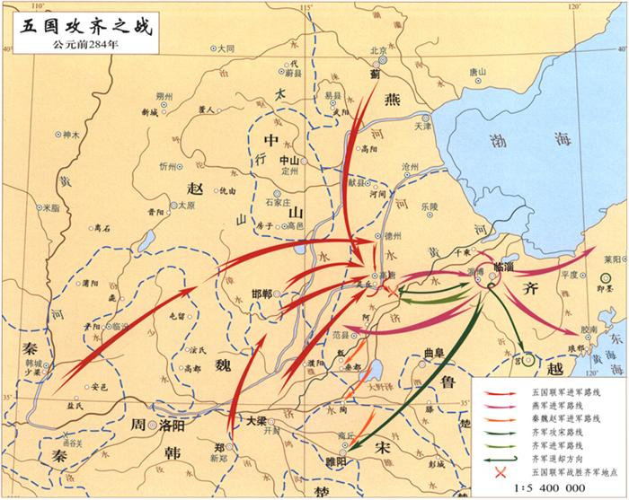
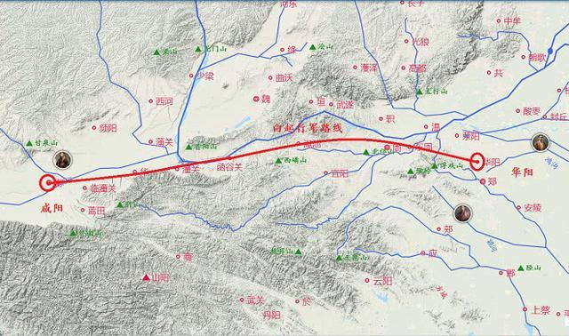

## 智宣子赵简子立储

智宣子将以瑶为后。智果曰：「不如宵也。瑶之贤于人者五，其不逮者一也。美鬓长大则贤，射御足力则贤，伎艺毕给则贤，巧文辩慧则贤，强毅果敢则贤，如是而甚不仁。夫以其五贤陵人，而以不仁行之，其谁能待之？若果立瑶也，智宗必灭。」 弗听，智果别族于太史为辅氏。

赵简子之子，长曰伯鲁，幼曰无恤。将置后，不知所立。乃书训戒之辞于二简，以授二子曰：「谨识之。」 三年而问之，伯鲁不能举其辞，求其简，已失之矣。问无恤，诵其辞甚习，求其简，出诸袖中而奏之。于是简子以无恤为贤，立以为后。

---

## 晋阳之战

（周贞定王十四年，前455年）三家以国人围而灌之，城不浸者三版。沈灶产蛙，民无叛意。智伯行水，魏桓子御，韩康子骖乘。智伯曰：「吾乃今知水可以亡人国也。」 桓子肘康子，康子履桓子之跗，以汾水可以灌安邑，绛水可以灌平阳也。

赵襄子使张孟谈潜出见二子，曰：「臣闻唇亡则齿寒。今智伯帅韩、魏而攻赵，赵亡则韩、魏为之次矣。」 二子曰：「我心知其然也，恐事末遂而谋泄，则祸立至矣」 。张孟谈曰：「谋出二主之口，入臣之耳，何伤也？」 二子乃阴与张孟谈约，为之期日而遣之。襄子夜使人杀守堤之吏，而决水灌智伯军。智伯军救水而乱，韩、魏翼而击之，襄子将卒犯其前，大败智伯之众。遂杀智伯，尽灭智氏之族。

---

## 义士豫让

赵襄子漆智伯之头，以为饮器。智伯之臣豫让欲为之报仇，乃诈为刑人，挟匕首，入襄子宫中涂厕。襄子如厕心动，索之，获豫让。左右欲杀之，襄子曰：「智伯死无后，而此人欲为报仇，真义士也！吾谨避之耳。」 乃舍之。豫让又漆身为 癞，吞炭为哑，行乞于市，其妻不识也。行见其友，其友识之，为之泣曰：「以子之才，臣事赵孟，必得近幸。子乃为所欲为，顾不易邪？何乃自苦如此！求以报仇，不亦难乎？」 豫让曰：「不可！既已委质为臣，而又求杀之，是二心也。凡吾所为者，极难耳。然所以为此者，将以愧天下后世之为人臣怀二心者也。」 襄子出，豫让伏于桥下。襄子至桥，马惊，索之，得豫让，遂杀之。

---

## 三家分晋

（周威烈王二十三年，前 403 年）初命晋大夫魏斯、赵籍、韩虔为诸侯。（司马光：故三晋之列于诸侯，非三晋之坏礼，乃天子自坏之也）

（周安王二十六年，前 376 年）王崩，子烈王喜立。魏、韩、赵共废晋靖公为家人而分其地。

---

## 魏文侯不弃虞人之期

文侯与群臣饮酒，乐，而天雨，命驾将适野。左右曰：「今日饮酒乐，天又雨，君将安之？」 文侯曰：「吾与虞人期猎，虽乐，岂可无一会期哉！」 乃往，身自罢之。

---

## 李悝识人五法

文侯谓李克曰：「先生尝有言曰：‘家贫思良妻，国乱思良相。’今所置非成则璜，二子何如？」 对曰：「卑不谋尊，疏不谋戚。臣在阙门之外，不敢当命。」文侯曰：「先生临事勿让。」 克曰：「君弗察故也。居视其所亲，富视其所与，达视其所举，穷视其所不为，贫视其所不取，五者足以定之矣，何待克哉！」 文侯曰：「先生就舍，吾之相定矣。」

吕氏春秋将其引申为：凡论人，通则观其所礼，贵则观其所进，富则观其所养，听则观其所行，止则观其所好。习则观其所言，穷则观其所不受，贱则观其所不为。喜之以验其守，乐之以验其僻，怒之以验其节，惧之以验其持。哀之以验其人，苦之以验其志。八观六验，此贤主之所以论人也。

---

## 吴起吮疽

吴起者，卫人，仕于鲁。齐人伐鲁，鲁人欲以为将，起取齐女为妻，鲁人疑之，起杀妻以求将，大破齐师。或谮之鲁侯曰：「起始事曾参，母死不奔丧，曾参绝之。今又杀妻以求为君将。起，残忍薄行人也。且以鲁国区区而有胜敌之名，则诸侯图鲁矣。」 起恐得罪。闻魏文侯贤，乃往归之。文侯问诸李克，李克曰：「起贪而好色，然用兵，司马穰苴* 弗能过也。」 于是文侯以为将，击秦，拔五城。起之为将，与士卒最下者同衣食，卧不设席，行不骑乘，亲裹赢粮，与士卒分劳苦。卒有病疽者，起为吮之。卒母闻而哭之。人曰：「子，卒也，而将军自吮其疽，何哭为？」 母曰：「非然也。往年吴公吮其父，其父战不还踵，遂死于敌。吴公今又吮其子，妾不知其死所矣，是以哭之。」

---

## 聂政

侠累与濮阳严仲子有恶。仲子闻轵人聂政之勇，以黄金百镒为政母寿，欲因以报仇。政不受，曰：「老母在，政身未敢以许人也！」 及母卒，仲子乃使政刺侠累。侠累方坐府上，兵卫甚众，聂政直入上阶，刺杀侠累，因自皮面抉眼，自屠出肠。韩人暴其尸于市，购问，莫能识。其姊嫈*闻而往哭之，曰：「是轵深井里聂政也。以妾尚在之故，重自刑以绝从。妾奈何畏殁身之诛，终灭贤弟之名！」 遂死于政尸之旁。

（春秋战国四大刺客：专诸杀吴王，要离刺庆忌，聂政杀侠累，荆轲刺秦王）

---

## 田氏代齐

（周安王十一年，前 391 年）田常生襄子盘，盘生庄子白，白生太公和。是岁，田和迁齐康公于海上，使食一城，以奉其先祀。

（十三年）齐田和会魏文侯、楚人、卫人于浊泽，求为诸侯。魏文侯为之请于王及诸侯，王许之。

（十六年）初命齐大夫田和为诸侯。

（二十三年）齐康公薨，无子，田氏遂并齐而有之。

---

## 阴晋之战

行之三年，秦人兴师，临于西河，魏士闻之，不待吏令，介胄而奋击之者，以万数。... 于是武侯从之。兼车五百乘，骑三千匹，而破秦五十万众。

---

## 在德不在险

武侯浮西河而下，中流顾谓吴起曰：「美哉山河之固，此魏国之宝也！」 对曰：「在德不在险。昔三苗氏，左洞庭，右彭蠡，德义不修，禹灭之；夏桀之居，左河济，右泰华，伊阙在其南，羊肠在其北，修政不仁，汤放之；商纣之国，左孟门，右太行，常山在其北，大河经其南，修政不德，武王杀之。由此观之，在德不在险。若君不修德，舟中之人皆敌国也。」 武侯曰：「善。」

---

## 吴起变法

（周安王十五年，前 387 年）楚悼王素闻其贤，至则任之为相。起明法审令，捐不急之官，废公族疏远者，以抚养战斗之士，要在强兵，破游说之言从横者。于是南平百越，北却三晋，西伐秦，诸侯皆患楚之强，而楚之贵戚大臣多怨吴起者。

（二十一年）楚悼王薨，贵戚大臣作乱，攻吴起，起走之王尸而伏之。击起之徒因射刺起，并中王尸。既葬，肃王即位。使令尹尽诛为乱者，坐起夷宗者七十余家。

---

## 人主自臧，则众谋不进

子思言苟变于卫侯曰：「其材可将五百乘。」 公曰：「吾知其可将。然变也尝为吏，赋于民而食人二鸡子，故弗用也。」 子思曰：「__夫圣人之官人，犹匠之用木也，取其所长，弃其所短。__ 故杞梓连抱而有数尺之朽，良工不弃。今君处战国之世，选爪牙之士，而以二卵弃干城之将，此不可使闻于邻国也。」 公再拜曰：「谨受教矣。」 卫侯言计非是，而群臣和者如出一口。子思曰：「以吾观卫，所谓‘君不君，臣不臣’者也。」 公丘懿子曰：「何乃若是？」 子思曰：「人主自臧，则众谋不进。事是而臧之，犹却众谋，况和非以长恶乎！夫 __不察事之是非而悦人赞己，暗莫甚焉；不度理之所在而阿谀求容，谄莫甚焉。__ 君暗臣谄，以居百姓之上，民不与也。若引不已，国无类矣！」 子思言于卫侯曰：「君之国事将日非矣！」 公曰：「何故？」 对曰：「有由然焉。__君出言自以为是，而卿大夫莫敢矫其非；卿大夫出言亦自以为是，而士庶人莫敢矫其非。君臣既自贤矣，而群下同声贤之，贤之则顺而有福，矫之则逆而有祸，如此则善安从生！__ 《诗》曰：‘具曰予圣，谁知乌之雌雄？’抑亦似君之君臣乎？」

---

## 一鸣惊人的齐威王

齐威王召即墨大夫，语之曰：「自子之居即墨也，毁言日至。然吾使人视即墨，田野辟，人民给，官无事，东方以宁。是子不事吾左右以求助也。」 封之万家。召阿大夫，语之曰：「自子守阿，誉言日至。吾使人视阿，田野不辟，人民贫馁。昔日赵攻鄄，子不救；卫取薛陵，子不知。是子厚币事吾左右以求誉也。」 是日，烹阿大夫及左右尝誉者。于是群臣耸惧，莫敢饰诈，务尽其情，齐国大治，强于天下。

---

## 秦孝公招贤令

（周显王八年 前 361 年）孝公令国中曰：「昔我穆公，自岐、雍之间修德行武，东平晋乱，以河为界，西霸戎翟，广地千里，天子致伯，诸侯毕贺，为后世开业甚光美。会往者厉、躁、简公、出子之不宁，国家内忧，未遑外事。三晋攻夺我先君河西地，丑莫大焉。献公即位，镇抚边境，徙治栎阳，且欲东伐，复穆公之故地，修穆公之政令。寡人思念先君之意，常痛于心。宾客群臣有能出奇计强秦者，吾且尊官，与之分土。」

---

## 公叔痤举荐人才的失败

公孙鞅者，卫之庶孙也，好刑名之学。事魏相公叔痤，痤知其贤，未及进。会病，魏惠王往问之曰：「公叔病如有不可讳，将奈社稷何？」 公叔曰：「痤之中庶子卫鞅，年虽少，有奇才，愿君举国而听之！」 王嘿然。公叔曰：「君即不听用鞅，必杀之，无令出境。」 王许诺而去。叔召鞅谢曰：「吾先君而后臣，故先为君谋，后以告子。子必速行矣！」 鞅曰：「君不能用子之言任臣，又安能用子之言杀臣乎？」 卒不去。王出，谓左右曰：「公叔病甚，悲乎！欲令寡人以国听卫鞅也，既又劝寡人杀之，岂不悖哉！」

---

## 商鞅变法

（周显王十年，前 359 年）卫鞅欲变法，秦人不悦。卫鞅言于秦孝公曰：「__夫民不可与虑始，而可与乐成。论至德者不和于俗，成大功者不谋于众。__ 是以圣人苟可以强国，不法其故。」 甘龙曰：「不然。缘法而治者，吏习而民安之。」 卫鞅曰：「常人安于故俗，学者溺于所闻，以此两者，居官守法可也，非所与论于法之外也。智者作法，愚者制焉；贤者更礼，不肖者拘焉。」 公曰：「善。」 以卫鞅为左庶长，卒定变法之令。令民为什伍而相收司、连坐，告奸者与斩敌首同赏，不告奸者与降敌同罚。有军功者，各以率受上爵。为私斗者，各以轻重被刑大小。戮力本业，耕织致粟帛多者，复其身。事末利及怠而贫者，举以为收孥*。宗室非有军功论，不得为属籍。明尊卑爵秩等级，各以差次名田宅、臣妾、衣服。有功者显荣，无功者虽富无所芬华。

（周显王十九年）秦商鞅筑冀阙宫庭于咸阳，徙都之。令民父子、兄弟同室内息者为禁。并诸小乡聚集为一县，县置令、丞，凡三十一县。废井田，开阡陌，平斗、桶、权、衡、丈、尺。

（周显王二十一年）秦商鞅更为赋税法，行之。

---

## 徙木之赏，南门立信

既具未布，恐民之不信，乃立三丈之木于国都市南门，募民有能徙置北门者予十金。民怪之，莫敢徙。复曰：「能徙者予五十金！」 有一人徙之，辄予五十金。乃下令。令行期年，秦民之国都言新令之不便者以千数。于是太子犯法。卫鞅曰：「法之不行，自上犯之。太子，君嗣也，不可施刑。刑其傅公子虔，黥其师公孙贾。」 明日，秦人皆趋令。行之十年，秦国道不拾遗，山无盗贼，民勇于公战，怯于私斗，乡邑大治。

---

## 夫信者，人君之大宝也

臣光曰：夫信者，人君之大宝也。国保于民，民保于信。非信无以使民，非民无以守国。是故古之王者不欺四海，霸者不欺四邻，善为国者不欺其民，善为家者不欺其亲。不善者反之：欺其邻国，欺其百姓，甚者欺其兄弟，欺其父子。上不信下，下不信上，上下离心，以至于败。所利不能药其所伤，所获不能补其所亡，岂不哀哉！昔齐桓公不背曹沫之盟，晋文公不贪伐原之利，魏文侯不弃虞人之期，秦孝公不废徙木之赏。此四君者，道非粹白，而商君尤称刻薄，又处战攻之世，天下趋于诈力，犹且不敢忘信以畜其民，况为四海治平之政者哉！

> 注1：曹沫之盟 - 桓公与庄公既盟於坛上，曹沫执匕首劫齐桓公，桓公左右莫敢动，而问曰：“子将何欲？” 曹沫曰：“齐强鲁弱，而大国侵鲁亦甚矣。今鲁城坏即压齐境，君其图之。”桓公乃许尽归鲁之侵地。既已言，曹沫投其匕首，下坛，北面就群臣之位，颜色不变，辞令如故。桓公怒，欲倍其约。管仲曰：“不可。夫贪小利以自快，弃信於诸侯，失天下之援，不如与之。”於是桓公乃遂割鲁侵地，曹沫三战所亡地尽复予鲁。

> 注2：文公伐原 - 文公伐原，令以三日之粮。三日而原不降，公令疏军而去之。谍出曰：“原不过一二日矣！”军吏以告，公曰：“得原而失信，何以使人？夫信，民之所庇也，不可失也。”乃去之，及孟门，而原请降。

---

## 齐国之宝

（周显王十四年，前 355 年）齐威王、魏惠王会田于郊。惠王曰：「齐亦有宝乎？」 威王曰：「无有。」 惠王曰：「寡人国虽小，尚有径寸之珠，照车前后各十二乘者十枚。岂以齐大国而无宝乎？」 威王曰：「寡人之所以为宝者与王异。吾臣有檀子者，使守南城，则楚人不敢为寇，泗上十二诸侯皆来朝；吾臣有盼子者，使守高唐，则赵人不敢东渔于河；吾吏有黔夫者，使守徐州，则燕人祭北门，赵人祭西门，徙而从者七千余家；吾臣有种首者，使备盗贼，则道不拾遗。此四臣者，将照千里，岂特十二乘哉！」 惠王有惭色。

---

## 围魏救赵

齐威王使田忌救赵。初，孙膑与庞涓俱学兵法。庞涓仕魏为将军，自以能不及孙膑，乃召之。至，则以法断其两足而黥之，欲使终身废弃。齐使者至魏，孙膑以刑徒阴见，说齐使者。齐使者窃载与之齐。田忌善而客待之，进于威王。威王问兵法，遂以为师。于是威王谋救赵，以孙膑为将，辞以刑余之人不可。乃以田忌为将而孙子为师，居辎车中，坐为计谋。田忌欲引兵之赵。孙子曰：「夫解杂乱纷纠者不控拳，救斗者不搏撠。批亢捣虚，形格势禁，则自为解耳。今梁、赵相攻，轻兵锐卒必竭于外，老弱疲于内。子不若引兵疾走魏都，据其街路，冲其方虚，彼必释赵以自救。是我一举解赵之围而收弊于魏也。」 田忌从之。十月，邯郸降魏。魏师还，与齐战于桂陵，魏师大败。

---

## 围魏救韩

魏庞涓伐韩。韩请救于齐。齐威王召大臣而谋曰：「蚤救孰与晚救？」 成侯曰：「不如勿救。」 田忌曰：「弗救则韩且折而入于魏，不如蚤救之。」 孙膑曰：「夫韩、魏之兵未弊而救之，是吾代韩受魏之兵，顾反听命于韩也。且魏有破国之志，韩见亡，必东面而愬于齐矣。吾因深结韩之亲而晚承魏之弊，则可受重利而得尊名也。」 王曰：「善！」 乃阴许韩使而遣之。韩因恃齐，五战不胜，而东委国于齐。齐因起兵，使田忌、田婴、田盼将之，孙子为师，以救韩，直走魏都。庞涓闻之，去韩而归。魏人大发兵，以太子申为将，以御齐师。孙子谓田忌曰：「彼三晋之兵素悍勇而轻齐，齐号为怯。善战者因其势而利导之。《兵法》：‘百里而趣利者蹶上将，五十里而趣利者军半至。’」 乃使齐军入魏地为十万灶，明日为五万灶，又明日为二万灶。涓行三日，大喜曰：「我固知齐军怯，入吾地三日，士卒亡者过半矣！」 乃弃其步军，与其轻锐倍日并行逐之。孙子度其行，暮当至马陵。马陵道狭而旁多阻隘，可伏兵。乃斫大树，白而书之曰：「庞涓死此树下！」 于是令齐师善射者万弩夹道而伏，期日暮见火举而俱发。庞涓果夜到斫木下，见白书，以火烛之。读未毕，万弩俱发，魏师大乱相失。庞涓自知智穷兵败，乃自刭，曰：「遂成竖子之名！」 齐因乘胜大破魏师，虏太子申。

---

## 成侯恶田忌

成侯邹忌恶田忌，使人操十金，卜于市，曰：「我，田忌之人也。我为将三战三胜，欲行大事，可乎？」 卜者出，因使人执之。田忌不能自明，率其徒攻临淄，求成侯。不克，出奔楚。

---

## 卫鞅为商君

（周显王二十九年，前 340 年）卫鞅言于秦孝公曰：「秦之与魏，譬若人之有腹心之疾，非魏并秦，秦即并魏。何者？魏居岭 厄之西，都安邑，与秦界河，而独擅山东之利。利则西侵秦，病则东收地。今以君之贤圣，国赖以盛；而魏往年大破于齐，诸侯畔之，可因此时伐魏。魏不支秦，必东徙。然后秦据河山之固，东乡以制诸侯，此帝王之业也。」 公从之，使卫鞅将兵伐魏。魏使公子卬将而御之。军既相距，卫鞅遗公子卬书曰：「吾始与公子欢，今俱为两国将，不忍相攻，可与公子面相见盟，乐饮而罢兵，以安秦、魏之民。」 公子卬以为然，乃相与会。盟已，饮。而卫鞅伏甲士，袭虏公子卬，因攻魏师，大破之。魏惠王恐，使使献河西之地于秦以和。因去安邑，徙都大梁。乃叹曰：「吾恨不用公叔之言！」

秦封卫鞅商于十五邑，号曰商君。（秦孝公兑现《招贤令》的诺言）

---

## 鸟尽弓藏

（周显王三十一年，前 338 年）秦孝公薨，子惠文王立，公子虔之徒告商君欲反，发吏捕之。商君亡之魏。魏人不受，复内之秦。商君乃与其徒之商于，发兵北击郑。秦人攻商君，杀之，车裂以徇，尽灭其家。

赵良谏商鞅：「__千人之诺诺，不如一士之谔谔。__」...「今君之见也，因嬖人景监以为主；其从政也，凌轹公族，残伤百姓。公子虔杜门不出已八年矣。君又杀祝欢而黥公孙贾。《诗》曰：‘__得人者兴，失人者崩__。’此数者，非所以得人也。君之出也，后车载甲，多力而骈胁者为骖乘，持矛而操 闟戟 者旁车而趋。此一物不具，君固不出。《书》曰：‘__恃德者昌，恃力者亡。__’此数者，非恃德也。__君之危若朝露，而尚贪商于之富，宠秦国之政，畜百姓之怨。__ 秦王一旦捐宾客而不立朝，秦国之所以收君者岂其微哉！」

---

## 徐州相王

（周显王三十五年，前 334 年）齐王、魏王会于徐州以相王。（惠施祸水东引之策）

---

## 越无疆伐楚

（周显王三十五年，前 334 年）越王无疆伐齐。齐王使人说之以伐齐不如伐楚之利，越王遂伐楚。楚人大败之，乘胜尽取吴故地，东至于浙江。越以此散，诸公族争立，或为王，或为君，滨于海上，朝服于楚。

（周显王三十六年）楚王伐齐，围徐州。（陈轸巧舌如簧退楚兵，成语「画蛇添足」的由来）

---

## 锥刺股，前倨后恭（可能是后人伪造）

（苏秦）说秦王书十上而说不行，黑貂之裘弊，黄金百斤尽，资用乏绝，去秦而归。羸縢履蹻，负书担橐，形容枯槁，面目犁黑，状有归色。归至家，妻不下纴，嫂不为炊，父母不与言。苏秦喟叹曰：“妻不以为夫，嫂不以我为叔，父母不以我为子，是皆秦之罪也！”乃夜发书，陈箧数十，得《太公阴符》之谋，伏而诵之，简练以为揣、摩。读书欲睡，引锥自刺其股，血流至足。曰：“安有说人主不能出其金玉锦绣、取卿相之尊者乎？”期年揣、摩成，曰：“此真可以说当世之君矣。”

...

将说楚王，路过洛阳。父母闻之，清宫除道，张乐设饮，郊迎三十里；妻侧目而视，倾耳而听；嫂蛇行匍伏，四拜自跪谢。苏秦曰：“嫂何前倨而后卑也？”嫂曰：“以季子之位尊而多金。”苏秦曰：“嗟乎！贫穷则父母不子，富贵则亲戚畏惧。人生世上，势位富贵，盖可忽乎哉！”

---

## 苏秦智激张仪（可能是后人伪造）

肃侯大说，厚待苏秦，尊宠赐赉之，以约于诸侯。会秦使犀首*伐魏，大败其师四万余人，禽将龙贾，取雕阴，且欲东兵。苏秦恐秦兵至赵而败从约，念莫可使用于秦者，乃激怒张仪，入之于秦。

张仪者，魏人，与苏秦俱事鬼谷先生，学纵横之术，苏秦自以为不及也。仪游诸侯无所遇，困于楚，苏秦故召而辱之。仪怒，念诸侯独秦能苦越，遂入秦。苏秦阴遣其舍人赍金币资仪，仪得见秦王。秦王说之，以为客卿。舍人辞去，曰：「苏君忧秦伐赵败从约，以为非君莫能得秦柄，故激怒君，使臣阴奉给君资，尽苏君之计谋也。」 张仪曰：「嗟乎！此在吾术中而不悟，吾不及苏君明矣。为吾谢苏君，苏君之时，仪何敢言！」

---

## 五国相王

（周显王四十四年，前 325 年）夏，四月，戊午，秦初称王。

（周显王四十六年）韩、燕皆称王，赵武灵王独不肯，曰：「无其实，敢处其名乎？」 令国人谓己曰君。

---

## 苏秦死间

（周显王四十五年，前 324 年）苏秦通于燕文公之夫人，易王知之。苏秦恐，乃说易王曰：「臣居燕不能使燕重，而在齐则燕重。」 易王许之。乃伪得罪于燕而奔齐，齐宣王以为客卿。苏秦说齐王高宫室，大苑囿，以明得意，欲以敝齐而为燕。

（周慎靓王四年，前 317 年）齐大夫与苏秦争宠，使人刺秦，杀之。

> 《史记 苏秦列传第九》：湣王即位，说湣王厚葬以明孝，高宫室大苑囿以明得意，欲破敝齐而为燕。燕易王卒，燕哙立为王。其後齐大夫多与苏秦争宠者，而使人刺苏秦，不死，殊而走。齐王使人求贼，不得。苏秦且死，乃谓齐王曰：“臣即死，车裂臣以徇於市，曰‘苏秦为燕作乱於齐’，如此则臣之贼必得矣。”於是如其言，而杀苏秦者果自出，齐王因而诛之。燕闻之曰：“甚矣，齐之为苏生报仇也！”

---

## 海大鱼

齐王封田婴于薛，号曰靖郭君。靖郭君言于齐王曰：「五官之计，不可不日听而数览也。」 王从之。已而厌之，悉以委靖郭君。靖郭君由是得专齐之权。靖郭君欲城薛，客谓靖郭君曰：「君不闻海大鱼乎？网不能止，钩不能牵，荡而失水，则蝼蚁制焉。__今夫齐，亦君之水也。君长有齐，奚以薛为！苟为失齐，虽隆薛之城到于天，庸足恃乎？__」 乃不果城。靖郭君有子四十余人，其贱妾之子曰文。文通傥饶智略，说靖郭君以散财养士。靖郭君使文主家待宾客，宾客争誉其美，皆请靖郭君以文为嗣。靖郭君卒，文嗣为薛公，号曰孟尝君。孟尝君招致诸侯游士及有罪亡人，皆舍业厚遇之，存救其亲戚。食客常数千人，各自以为孟尝君亲己。由是孟尝君之名重天下。

---

## 孟尝君纳谏

孟尝君聘于楚，楚王遗之象床。登徒直送之，不欲行，谓孟尝君门人公孙戌曰：「象床之直千金，苟伤之毫发，则卖妻子不足偿也。足下能使仆无行者，有先人之宝剑，愿献之。」 公孙戌许诺，入见孟尝君曰：「小国所以皆致相印于君者，以君能振达贫穷，存亡继绝，故莫不悦君之义，慕君之廉也。今始至楚而受象床，则未至之国将何以待君哉！」 孟尝君曰：「善。」 遂不受。公孙戌趋去，未至中闺，孟尝君召而反之，曰：「子何足之高，志之扬也？」 公孙戌以实对。孟尝君乃书门版曰：「有能扬文之名，止文之过，私得宝于外者，疾入谏！」

---

## 缪留谏韩宣惠王

韩宣惠王俗两用公仲、公叔为政，问于缪留。对曰：「不可。晋用六卿而国分，齐简公用陈成子及阚止而见杀，魏用犀首、张仪而西河之外亡。今君两用之，其多力者内树党，其寡力者藉外权。群臣有内树党以骄主，有外为交以削地，君之国危矣！」

---

## 函谷关之战

（周慎靓王三年，前 318 年）楚、赵、魏、韩、燕同伐秦，攻函谷关。秦人出兵逆之，五国之师皆败走。

> 战国策 卷四 秦策二》：义渠君之魏，公孙衍谓义渠君曰：“道远，臣不得复过矣，请谒事情。”义渠君曰：“愿闻之。”对曰：“中国无事于秦，则秦且烧爇获君之国；中国为有事于秦，则秦且轻使重币，而事君之国也。”义渠君曰：“谨闻令。”居无几何，五国伐秦。陈轸谓秦王曰：“义渠君者，蛮夷之贤君，王不如赂之以抚其心。”秦王曰： “善。”因以文绣千匹，好女百人，遗义渠君。义渠君致群臣而谋曰：“此乃公孙衍之所谓也。”因起兵袭秦，大败秦人于李帛之下。

---

## 修鱼之战

（周慎靓王四年，前 317 年）秦败韩师于修鱼，斩首八万级，虏其将 叟、申差于浊泽。诸侯振恐。

---

## 秦灭巴蜀

（周慎靓王五年，前 316 年）巴、蜀相攻击，俱告急于秦。秦惠王欲伐蜀。以为道险狭难至，而韩又来侵，犹豫未能决。司马错请伐蜀。张仪曰：「不如伐韩。」 王曰：「请闻其说。」 仪曰：「亲魏，善楚，下兵三川，攻新城、宜阳，以临二周之郊，据九鼎，按图籍，挟天子以令于天下，天下莫敢不听，此王业也。臣闻争名者于朝，争利者于市。今三川、周室，天下之朝、市也，而王不争焉，顾争于戎翟，去王业远矣！」 司马错曰：「不然，臣闻之，欲富国者务广其地，欲强兵者务富其民，欲王者务博其德，三资者备而王随之矣。今王地小民贫，故臣愿先从事于易。夫蜀，西僻之国而戎翟之长也，有桀、纣之乱，以秦攻之，譬如使豺狼逐群羊。得其地足以广国，取其财足以富民，缮兵不伤众而彼已服焉。拔一国而天下不以为暴，利尽西海而天下不以为贪，是我一举而名实附也，而又有禁暴止乱之名。今攻韩，劫天子，恶名也，而未必利也，又有不义之名，而攻天下所不欲，危矣！臣请论其故。周，天下之宗室也；齐，韩之与国也。周自知失九鼎，韩自知亡三川，将二国并力合谋，以因乎齐、赵而求解乎楚、魏。以鼎与楚，以地与魏，王弗能止也。此臣之所谓危也。不如伐蜀完。」 王从错计，起兵伐蜀。十月取之。贬蜀王，更号为侯，而使陈庄相蜀。蜀既属秦，秦以益强，富厚，轻诸侯。

---

## 子之之乱

（周赧王元年 前 314 年）燕子之为王三年，国内大乱。将军市被与太子平谋攻子之。齐王令人谓燕太子曰：「寡人闻太子将饬君臣之义，明父子之位，寡人之国虽小，唯太子所以令之。」 太子因要党聚众，使市被攻子之，不克。市被反攻太子。构难数月，死者数万人，百姓恫恐。齐王令章子将五都之兵，因北地之众以伐燕。燕士卒不战，城门不闭。齐人取子之，醢 之，遂杀燕王哙。

---

## 张仪欺怀王

秦王欲伐齐，患齐、楚之从亲，乃使张仪至楚，说楚王曰：「大王诚能听臣，闭关绝约于齐，臣请献商于之地六百里，使秦女得为大王箕帚之妾，秦、楚娶妇嫁女，长为兄弟之国。」 楚王说而许之。君臣皆贺，陈轸独吊。王怒曰：「寡人不兴师而得六百里地，何吊也？」 对曰：「不然。以臣观之，商于之地不可得而齐、秦合。齐、秦合则患必至矣！」 王曰：「有说乎？」 对曰：「夫秦之所以重楚者，以其有齐也。今闭关绝约于齐，则楚孤，秦奚贪夫孤国，而与之商于之地六百里？张仪至秦，必负王。是王北绝齐交，西生患于秦也。两国之兵必俱至。为王计者，不若阴合而阳绝于齐，使人随张仪。苟与吾地，绝齐未晚也。」 王曰 「愿陈子闭口，毋复言，以待寡人得地！」 乃以相印授张仪，厚赐之。遂闭关绝约于齐，使一将军随张仪至秦。仪佯堕车，不朝三月。楚王闻之，曰：「仪以寡人绝齐未甚邪？」 乃使勇士宋遗借宋之符，北骂齐王。齐王大怒，折节而事秦，齐、秦之交合。张仪乃朝，见楚使者曰：「子何不受地？从某至某，广袤六里。」 使者怒，还报楚王。楚王大怒，欲发兵而攻秦。陈轸曰：「轸可发口言乎？攻之不如因赂以一名都，与之并兵而攻齐，是我亡地于秦，取偿于齐也。今王已绝于齐而责欺于秦，是吾合秦、齐之交而来天下之兵也，国必大伤矣！」 楚王不听，使屈匄帅师伐秦。秦亦发兵使庶长章击之。

---

## 丹阳蓝田之战

春，秦师及楚战于丹杨，楚师大败，斩甲士八万，虏屈匄及列侯、执珪七十余人，遂取汉中郡。楚王悉发国内兵以复袭秦，战于蓝田，楚师大败。韩、魏闻楚之困，南袭楚，至邓。楚人闻之，乃引兵归，割两城以请平于秦。

---

## 千金买马骨

（周赧王元年 前 312 年）燕人共立太子平，是为昭王，昭王于破燕之后即位，吊死问孤，与百姓同甘苦，卑身厚币以招贤者。谓郭隗曰：「齐因孤之国乱而袭破燕，孤极知燕小力少，不足以报。然诚得贤士与共国，以雪先王之耻，孤之愿也。先生视可者，得身事之！」 郭隗曰：「古之人君有以千金使涓人求千里马者，马已死，买其首五百金而返。君大怒，涓人曰：‘死马且买之，况生者乎？马今至矣。’不期年，千里之马至者三。今王必欲致士，先从隗始。况贤于隗者，岂远千里哉？」 于是昭王为隗改筑宫而师事之。于是士争趣燕。乐毅自魏往，剧辛自赵往。昭王以乐毅为亚卿，任以国政。

---

## 张仪左右逢源

张仪说秦武王曰：「为王计者，东方有变，然后王可以多割得地也。臣闻齐王甚憎臣，臣之所在，齐必伐之。臣愿乞其不肖之身以之梁，齐必伐梁，齐、梁交兵而不能相去，王以其间伐韩，入三川，挟天子，案图籍，此王业也。」 王许之。齐王果伐梁，梁王恐。张仪曰：「王勿患也。请令齐罢兵。」 乃使其舍人之楚，借使谓齐王曰：「甚矣，王之托仪于秦也！」 齐王曰：「何故？」 楚使者曰：「张仪之去秦也，固与秦王谋矣，欲齐、梁相攻而令秦取三川也。今王果伐梁，是王内罢国而外伐与国，以信仪于秦王也。」 齐王乃解兵还。

---

## 孟子论张仪

《孟子》论之曰：或谓：「张仪、公孙衍，岂不大丈夫哉！一怒而诸侯惧，安居而天下熄。」 孟子曰：「是恶足以为大丈夫哉？君子立天下之正位，行天下之正道，得志则与民由之，不得志则独行其道，富贵不能淫，贫贱不能移，威武不能诎，是之谓大丈夫。」

---

## 丞相的由来

（周赧王六年 前 309 年）秦初置丞相，以樗里疾为右丞相。

---

## 如何给领导打预防针：息壤之盟与宜阳之战

秦王使甘茂约魏以伐韩，而令向寿辅行。甘茂至魏，令向寿还，谓王曰：「魏听臣矣，然愿王勿伐！」 王迎甘茂于息壤而问其故。对曰：「宜阳大县，其实郡也。今王倍数险，行千里，攻之难。鲁人有与曾参同姓名者杀人，人告其母，其母织自若也。及三人告之，其母投杼下机，逾墙而走。臣之贤不若曾参，王之信臣又不如其母，疑臣者非特三人，臣恐大王之投杼也。魏文侯令乐羊将而攻中山，三年而拔之。反而论功，文侯示之谤书一箧。乐羊再拜稽首曰：‘此非臣之功，君之力也。’今臣，羁旅之臣也，樗里子、公孙奭挟韩而议之，王必听之，是王欺魏王而臣受公仲侈之怨也。」 王曰：「寡人弗听也，请与子盟。」 乃盟于息壤。秋，甘茂、长封帅师伐宜阳。

（周赧王八年）甘茂攻宜阳，五月而不拔。樗里子、公孙奭果争之。秦王召甘茂，欲罢兵。甘茂曰：「息壤在彼。」 王曰：「有之。」 因大悉起兵以佐甘茂。斩首六万，遂拔宜阳。韩公仲侈入谢于秦以请平。

---

## 秦武王扛鼎绝膑

（周赧王八年 前 307 年）秦武王好以力戏，力士任鄙、乌获、孟说皆至大官。八月，王与孟说举鼎，绝脉而薨。族孟说。

---

## 赵武灵王胡服骑射

（周赧王八年 前 307 年）赵武灵王北略中山之地，至房子，遂之代，北至无穷，西至河，登黄华之上。与肥义谋胡服骑射以教百姓，曰：「愚者所笑，贤者察焉。虽驱世以笑我，胡地、中山，吾必有之！」 遂胡服。国人皆不欲，公子成称疾不朝。王使人请之曰：「家听于亲，国听于君。今寡人作教易服而公叔不服，吾恐天下议之也。__制国有常，利民为本；从政有经，令行为上。明德先论于贱，而从政先信于贵__，故愿慕公叔之义以成胡服之功也。」 公子成再拜稽首曰：「臣闻中国者，圣贤之所教也，礼乐之所用也，远方之所观赴也，蛮夷之所则效也。今王舍此而袭远方之服，变古之道，逆人之心，臣愿王熟图之也！」 使者以报。王自往请之，曰：「吾国东有齐、中山，北有燕、东胡，西有楼烦、秦、韩之边。今无骑射之备，则何以守之哉？先时中山负齐之强兵，侵暴吾地，系累吾民，引水围鄗；微社稷之神灵，则鄗几于不守也，先君丑之。故寡人变服骑射，欲以备四境之难，报中山之怨。而叔顺中国之俗，恶变服之名，以忘鄗事之丑，非寡人之所望也。」 公子成听命，乃赐胡服，明日服而朝。于是始出胡服令，而招骑射焉。

---

## 楚怀王被扣留

（周赧王十六年 前 299 年）秦人伐楚，取八城。秦王遗楚王书曰：「始寡人与王约为兄弟，盟于黄棘，太子入质，至欢也。太子陵杀寡人之重臣，不谢而亡去。寡人诚不胜怒，使兵侵君王之边。今闻君王乃令太子质于齐以求平。寡人与楚接境，婚姻相亲。而今秦、楚不欢，则无以令诸侯。寡人愿与君王会武关，面相约，结盟而去，寡人之愿也！」 楚王患之，欲往，恐见欺，欲不往，恐秦益怒。昭睢曰：「毋行而发兵自守耳！秦，虎狼也，有并诸侯之心，不可信也！」 怀王之子子兰劝王行，王乃入秦。秦王令一将军诈为王，伏兵武关，楚王至则闭关劫之，与俱西，至咸阳，朝章台，如藩臣礼，要以割巫、黔中郡。楚王欲盟，秦王欲先得地。楚王怒曰：「秦诈我，而又强要我以地！」 因不复许，秦人留之。

---

## 鸡鸣狗盗

（周赧王十六年 前 299 年）秦王闻孟尝君之贤，使泾阳君为质于齐以请。孟尝君来入秦，秦王以为丞相。

（周赧王十七年）或谓秦王曰：「孟尝君相秦，必先齐而后秦。秦其危哉！」 秦王乃以楼缓为相，囚孟尝君，欲杀之。孟尝君使人求解于秦王幸姬，姬曰：「愿得君狐白裘。」 孟尝君有狐白裘，已献之秦王，无以应姬求。客有善为狗盗者，入秦藏中，盗狐白裘以献姬。姬乃为之言于王而遣之。王后悔，使追之。孟尝君至关。关法：鸡鸣而出客。时尚蚤，追者将至，客有善为鸡鸣者，野鸡闻之皆鸣。孟尝君乃得脱归。

---

## 孟尝君合纵

（周赧王十九年 前 296 年）齐、韩、魏、赵、宋同击秦，至盐氏而还。秦与韩武遂、与魏封陵以和。

---

## 沙丘之乱

（周赧王二十年 前 295 年）主父使惠文王朝群臣而自从旁窥之，见其长子傫然也，反北面为臣。诎于其弟，心怜之，于是乃欲分赵而王公子章于代，计未决而辍。主父及王游沙丘，异宫，公子章、田不礼以其徒作乱，诈以主父令召王。肥义先入，杀之。高信即与王战。公子成与李兑自国至，乃起四邑之兵入距难，杀公子章及田不礼，灭其党。公子成为相，号安平君；李兑为司寇。是时惠文王少，成、兑专政。公子章之败也，往走主父，主父开之。成、兑因围主父宫。公子章死，成、兑谋曰：「以章故，围主父；即解兵，吾属夷矣！」 乃遂围之，令：「宫中人后出者夷！」 宫中人悉出。主父欲出不得，又不得食，探雀鷇而食之。三月余，饿死沙丘宫。主父定死，乃发丧赴诸侯。主父初以长子章为太子，后得吴娃，爱之，为不出者数岁。生子何，乃废太子章而立之。吴娃死，爱驰；怜故太子，欲两王之，犹豫未决，故乱起。

---

## 白起横空出世

（周赧王二十二年 前 293 年）韩公孙喜、魏人伐秦。穰侯荐左更白起于秦王以代向寿将兵，败魏师、韩师于伊阙，斩首二十四万级，虏公孙喜，拔五城。秦王以白起为国尉。

（周赧王二十六年 前 289 年）秦大良造白起、客卿错伐魏，至轵，取城大小六十一。

（周赧王三十五年 前 280 年）秦白起败赵军，斩首二万，取代光狼城。

（周赧王三十六年 前 279 年）秦白起伐楚，取鄢、邓、西陵。

（周赧王三十七年 前 278 年）秦大良造白起伐楚，拔郢，烧夷陵。楚襄王兵散，遂不复战，东北徙都于陈。秦以郢为南郡，封白起为武安君。

（周赧王三十八年 前 277 年）秦武安君定巫、黔中，初置黔中郡。

（周赧王三十九年 前 276 年）秦武安君伐魏，拔两城。

---

## 五国攻齐之战

（周赧王三十一年 前 284 年）燕王悉起兵，以乐毅为上将军。秦尉斯离帅师与三晋之师会之。赵王以相国印授乐毅，乐毅并将秦、魏、韩、赵之兵以伐齐。齐湣王悉国中之众以拒之，战于济西，齐师大败。乐毅还秦、韩之师，分魏师以略宋地，部赵师以收河间，身率燕师，长驱逐北。剧辛曰：__「齐大而燕小，赖诸侯之助以破其军，宜及时攻取其边城以自益，此长久之利也。今过而不攻，以深入为名，无损于齐，无益于燕，而结深怨，后必悔之。」__ 乐毅曰：__「齐王伐功矜能，谋不逮下，废黜贤良，信任谄谀，政令戾虐，百姓怨怼。今军皆破亡，若因而乘之，其民必叛，祸乱内作，则齐可图也。若不遂乘之，待彼悔前之非，改过恤下而抚其民，则难虑也。」__ 遂进军深入。齐人果大乱失度，湣王出走。乐毅入临淄，取宝物、祭器，输之于燕。

---

## 完璧归赵

（周赧王三十二年 前 283 年）赵王得楚和氏璧，秦昭王欲之，请易以十五城。赵王欲勿与，畏秦强，欲与之，恐见欺。以问蔺相如，对曰：__「秦以城求璧而王不许，曲在我矣；我与之璧而秦不与我城，则曲在秦。均之二策，宁许以负秦。臣愿奉璧而往；使秦城不入，臣请完璧而归之。」__ 赵王遣之。相如至秦，秦王无意偿赵城。相如乃以诈绐秦王，复取璧，遣从者怀之，间行归赵，而以身待命于秦。秦王以为贤而弗诛，礼而归之。赵王以相如为上大夫。

---

## 渑池相会

秦王使使者告赵王，愿为好会于河外渑池。赵王欲毋行，廉颇、蔺相如计曰：__「王不行，示赵弱且怯也。」__ 赵王遂行，相如从。廉颇送至境，与王诀曰：__「王行，度道里会遇之礼毕，还，不过三十日。三十日不还，则请立太子，以绝秦望。」__ 王许之。会于渑池。王与赵王饮，酒酣，秦王请赵王鼓瑟，赵王鼓之。蔺相如复请秦王击缶，秦王不肯。相如曰：__「五步之内，臣请得以颈血溅大王矣！」__ 左右欲刃相如，相如张目叱之，左右皆靡。王不怿，为一击缶。罢酒，秦终不能有加于赵。赵人亦盛为之备，秦不敢动。

---

## 将相和

赵王归国，以蔺相如为上卿，位在廉颇之右。廉颇曰：__「我为赵将，有攻城野战之功。蔺相如素贱人，徒以口舌而位居我上。吾羞，不忍为之下！」__ 宣言曰：__「我见相如，必辱之！」__ 相如闻之，不肯与会；每朝，常称病，不欲争列。出而望见，辄引车避匿。其舍人皆以为耻。相如曰：__「子视廉将军孰与秦王？」__ 曰：__「不若。」__ 相如曰：__「夫以秦王之威而相如廷叱之，辱其群臣。相如虽驽，独畏廉将军哉！顾吾念之，强秦之所以不敢加兵于赵者，徒以吾两人在也。今两虎共斗，其势不俱生。吾所以为此者，先国家之急而后私仇也。」__ 廉颇闻之，肉袒负荆至门射罪，遂为刎颈之交。

---

## 火牛阵

（周赧王三十六年 前 279 年）燕军益懈。田单乃收城中，得牛千余，为绛缯衣，画以五采龙文，束兵刃于其角，而灌脂束苇于其尾，烧其端，凿城数十穴，夜纵牛，壮士五千人随其后。牛尾热，怒而奔燕军。燕军大惊，视牛皆龙文，所触尽死伤。而城中鼓噪从之，老弱皆击铜器为声，声动天地。燕军大骇，败走。齐人杀骑劫，追亡逐北，所过城邑皆叛燕，复为齐。田单兵日益多，乘胜，燕日败亡，走至河上，而齐七十余城皆复焉。

---

## 田单攻狄

（周赧王三十六年 前 279 年）田单将攻狄，往见鲁仲连。鲁仲连曰：__「将军攻狄，不能下也。」__ 田单曰：__「臣以即墨破亡余卒破万乘之燕，复齐之墟，今攻狄而不下，何也？」__ 上车弗谢而去，遂攻狄，三月不克。齐小儿谣曰：__「大冠若箕，修剑拄颐。攻狄不能下，垒枯骨成丘。」__ 田单乃惧，问鲁仲连曰：__「先生谓单不能下狄，请问其说。」__ 鲁仲连曰：__「将军之在即墨，坐则织蒉，立则仗锸，为士卒倡曰：‘无可往矣！宗庙亡矣！今日尚矣！归于何党矣！’当此之时，将军有死之心，士卒先无之气，闻君言莫不挥泣奋臂而欲战，此所以破燕也。当今将军东有夜邑之奉，西有淄上之娱，黄金横带而骋乎淄、渑之间，有生之乐，无死之心，所以不胜也。」__ 田单曰：__「单之有心，先生志之矣。」__ 明日，乃厉气循城，立于矢石之所，援袍鼓之。狄人乃下。

---

## 以地事秦犹抱薪救火

赵人、魏人伐韩华阳。韩人告急于秦，秦王弗救。韩相国谓陈筮曰：__「事急矣！愿公虽病，为一宿之行。」__ 陈筮如秦，见穰侯。穰侯曰：__「事急乎？故使公来。」__ 陈筮曰：__「未急也。」__ 穰侯怒曰：__「何也？」__ 陈筮曰：__「彼韩急则将变而他从；以未急，故复来耳。」__ 穰侯曰：__「请发兵矣。」__ 乃与武安君及客卿胡阳救韩，八日而至，败魏军于华阳之下，走芒卯，虏三将，斩首十三万。武安君又与赵将贾偃战，沈其卒二万人于河。魏段干子请割南阳予秦以和。苏代谓魏王曰：__「欲玺者，段干子也；欲地者，秦也。今王使欲地者制玺，欲玺者制地，魏地尽矣！_夫以地事秦，犹抱薪救火，薪不尽，火不灭_。」__ 王曰：__「是则然也。虽然，事始已行，不可更矣！」__ 对曰：__「夫博之所以贵枭者，便则食，不便则止。今何王之用智不如用枭也？」__ 魏王不听，卒以南阳为和，实修武。
